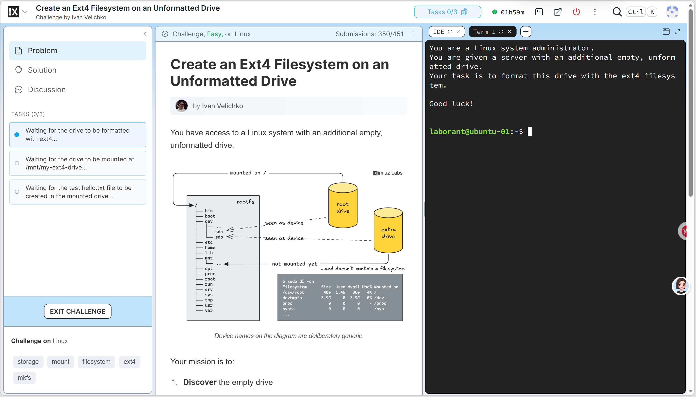
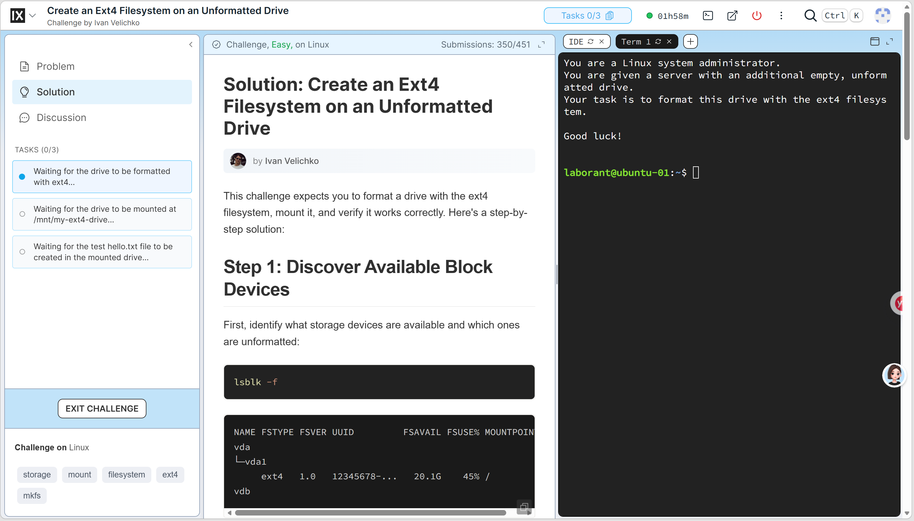
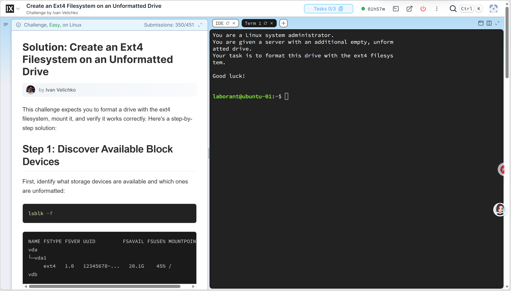
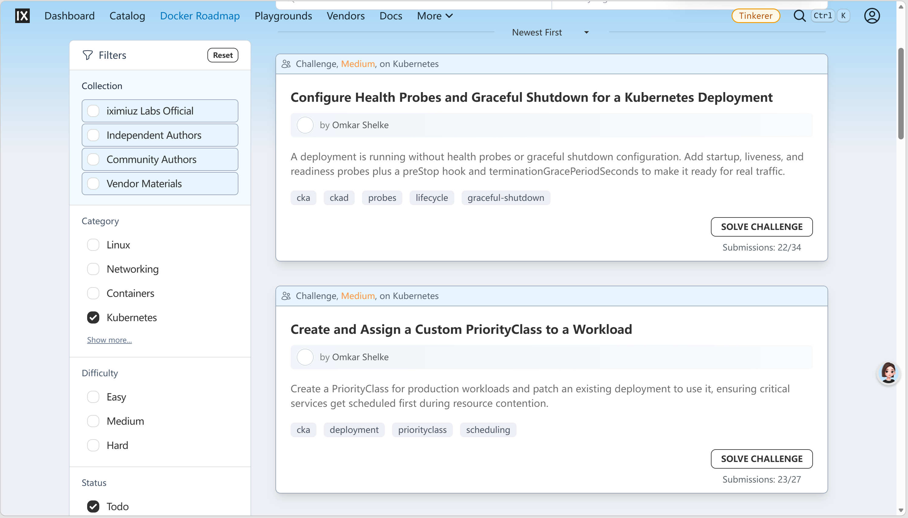
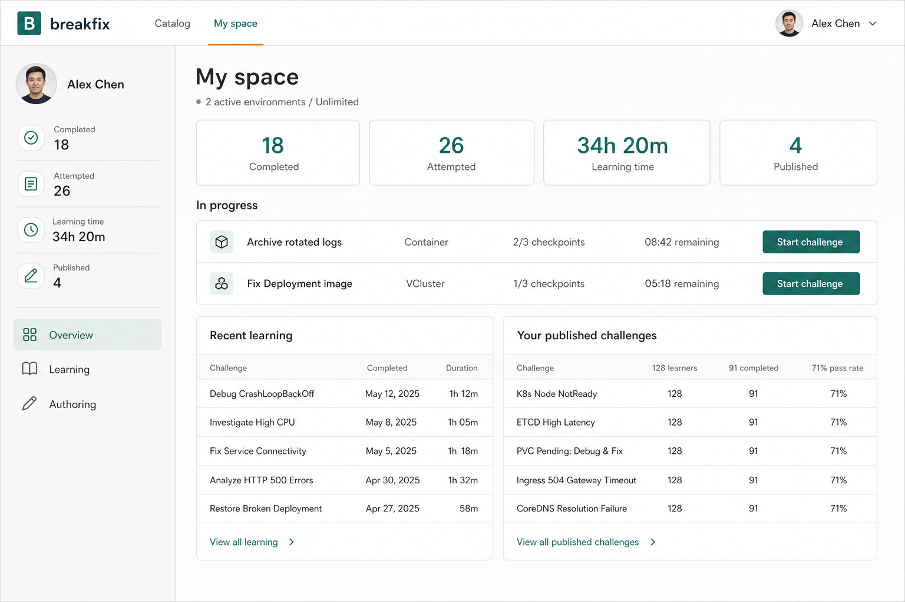

# 学习与创作体验

Breakfix 的核心体验是：用户在真实、可回收的运行环境中完成一个明确的问题；平台持续展示公开检查点，而不是要求用户点击提交。题目作者通过对话审核意图和已验证产物，而不是直接编辑生成代码。

## 视觉参考

工作台借鉴 iximiuz Labs 的浅色、高信息密度、固定工作区思路，但不复制其品牌、文案或产品功能。以下图片只是信息架构和交互密度的参考：

## 题库与工作台

Catalog 公开展示当前 RoadmapRevision 中已绑定的题目摘要，并按搜索、标签、难度、runtime、学习状态和发布时间帮助用户定位题目。登录用户能看到自己题目的完成、进行中和检查点进度；未登录用户只能浏览摘要。卡片展示题目概览和唯一 Topic；Problem 面板展示本题练习目标。移动端保留浏览与筛选，不把需要键盘的终端和创作工作流压缩进手机布局。

开始题目会进入固定工作台：左侧显示 Problem、Solution、Assistant 和公开检查点，右侧是浏览器终端。Problem、Solution 和提示服务于同一组检查点；用户可以打开多个终端窗口、重置环境或停止挑战。页面本身不应滚动，正文、助手消息和终端各自管理滚动区域。

检查点是周期性的自动判断。Controller 将当前结果写入 Environment status，工作台和目录读取这份权威状态；所有检查点通过后挑战自动完成。没有用户可见的 Submit，也不要求用户为了证明完成而上传结果。

## 终端上下文助手

助手是工作台中的第三个文档面板，而不是会遮挡终端的悬浮聊天框。回复以 Markdown 呈现，并通过流式事件逐步显示。它不会把所有终端活动无差别塞入上下文，而是按需调用只读工具：

- 读取指定 tmux 窗口的近期 scrollback。
- 读取 Controller 保存的检查点快照。
- 列出或读取当前环境中的文件。
- 在需要解释正确方案或用户明确要求时读取参考解答。

助手工具不修改用户环境。会话与 Environment UID 绑定；Stop、Reset 或环境回收会清理相应对话，避免将旧环境上下文带到新挑战。

## 作者工作台

作者在同一页面完成自然语言讨论、题意约定和已验证 revision 审核。左侧内容面板只读，右侧是对话；修改题意或检查点只能通过 agent 的受控领域操作，不能直接编辑题目文件。

作者明确确认后，系统生成题目，并通过 `Build -> ArtifactPublish -> Verify` 在真实环境中验证。候选 artifact 失败会由内部 generator/judge 循环修复，作者不会看到未经验证的代码产物。验证成功后，作者可以查看题目资产、检查点、diff 和验证摘要，再显式发布。

作者工作流的状态、artifact 交接和发布边界见[工作流](../architecture/workflows.md)。

## My space

My space 汇总当前用户的学习和创作事实：已完成与已尝试题数、有效终端学习时长、进行中的环境、学习历史、进行中的作者会话以及已发布题目的匿名聚合统计。它不复制 catalog 到数据库：题目名称、runtime 和难度仍从文件系统题库读取。

学习记录通过 Server 对 Environment status 的幂等投影保存，因此环境被 Stop、Reset 或闲置回收后，完成和尝试历史仍可见。终端学习时长按环境级有效连接区间去重，多个 shell 不会重复累计。

## 产品边界

- 题目生成、验证和发布是作者流程；学习者不上传 challenge artifact。
- Solution 是学习资产，检查点是完成判断；两者不通过手动提交按钮耦合。
- Catalog、Workspace、My space 和 Authoring 维持单页应用导航，不引入多页面路由作为产品前提。
- 学习路径、推荐、排行榜、讨论区、付费和组织集成需要更大题库或真实使用数据，当前方向见根目录 [`NEXT.md`](../../NEXT.md)。
- Domain、Topic、Tag、Challenge binding 与关系图不属于 challenge manifest；它们由 immutable RoadmapRevision 提供。
