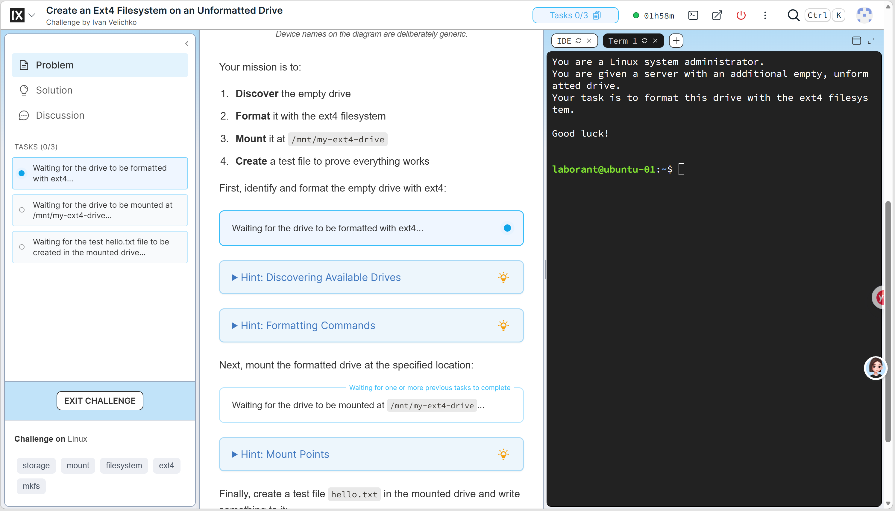

# 基于检查点的 Challenge 工作台改造

## 目标

把当前“进入题目、操作终端、一次性判定”的流程，升级为面向 SRE 学习的固定工作台：用户在操作过程中能看到当前完成了哪些目标、每个目标为何通过或失败，并能阅读按步骤组织的解答和讲解。

新 UI 以 iximiuz Labs 的挑战工作台作为明确的视觉与交互参考，截图保存在当前目录。采用其浅色、高信息密度、固定三栏工作区、顶部状态栏、可折叠侧栏和终端 tab 的设计方向；不复制其品牌、视觉资产、文案或 Discussion/IDE 等非本项目功能。

## UI 参考截图





## 产品原则

1. 检查点验证环境的当前状态，不检查用户是否执行过某条指定命令。
2. 用户可以通过任何合理方法完成题目；检查点只描述必须成立的可观察结果。
3. 检查点不是不可逆历史。用户后来破坏了环境时，已完成标记应回退。
4. 检查点是题目唯一的判定事实来源。controller 周期执行同一个检查点聚合器并写入状态，进度展示只读取该状态，不能存在额外的最终规则。
5. 解答和提示是正式题目资产，不把 `answer.sh` 直接当成用户文档。
6. 平台是学习环境而不是防作弊考试。用户可以查看 Solution；验证脚本仍应保持只读，不能依靠修改用户环境来获得结论。

## 题目内容契约

每个题目目录扩展为：

```text
challenges/<id>/
  challenge.yaml
  problem.md
  solution.md
  hints/
    <checkpoint-id>.md
  checks/
    checkpoints.sh
  generate.sh
  answer.sh
```

### `challenge.yaml`

保留已有元数据、运行时和环境配置，并增加检查点的展示元数据：

```yaml
checkpoints:
  - id: nginx-installed
    title: 安装 Nginx
    description: Nginx 已安装且可以运行。
    hint: hints/nginx-installed.md
  - id: systemd-service-configured
    title: 配置 systemd 服务
    description: 服务单元文件满足题目要求。
    hint: hints/systemd-service-configured.md
    dependsOn: [nginx-installed]
  - id: nginx-serving
    title: 启动并验证服务
    description: 服务已启动，且 HTTP 请求可成功响应。
    hint: hints/nginx-serving.md
    dependsOn: [systemd-service-configured]
```

`dependsOn` 只用于引导和 UI 状态，不改变验证语义。后续检查点即使前置项尚未通过，也可以报告它自身可观察到的状态。

### 检查器协议

`checks/checkpoints.sh --json` 一次执行所有检查，输出唯一 JSON 文档：

```json
{
  "checks": [
    {
      "id": "nginx-installed",
      "passed": true,
      "summary": "nginx 1.26.1 is installed",
      "details": "nginx -v completed successfully"
    }
  ]
}
```

约束：

- 检查器只读取和验证环境状态，不修改文件、服务或 Kubernetes 资源。
- 每个 `id` 必须与 `challenge.yaml` 中的检查点一一对应。
- 非零退出码、无法解析的 JSON、未知或缺失的 ID 都是检查器错误，不应伪装成用户未完成。
- `summary` 面向状态列表；`details` 面向用户诊断，均不得泄露平台内部密钥。

### 自动完成

不存在独立的 `verify.sh`。所有必需检查点通过即代表题目完成；任一检查点失败时环境保持可操作。controller 周期执行 `checks/checkpoints.sh --json`，解析并保存完整检查结果；全部通过后自动将环境标记为 Completed。

进度查询不执行检查器，只读取 controller 保存的结果快照。不能保留只在某个用户动作时才执行的额外条件。

### 文档资产

- `problem.md`：场景、目标、约束、相关图示与背景知识。
- `hints/<id>.md`：与单个检查点对应的渐进提示，不直接替代完整解答。
- `solution.md`：按检查点拆分的完整解法、命令说明、验证方式和常见错误。
- `answer.sh`：仅用于平台自动验收或作者自测，不作为 Solution 的数据源。

## Gateway 与运行时

### 进度接口

新增受登录和环境归属保护的接口：

```text
GET /api/challenges/:id/progress
```

Gateway 查找用户在该题目上的环境，读取 controller 保存的结构化检查点结果。接口应区分以下状态：

- 环境尚未就绪。
- 尚未产生第一次检查结果。
- 检查器协议错误。
- 已取得有效检查结果。

检查由 controller 在环境内执行，并有短超时和输出上限。进度接口不创建 `VerifyTask`，也不修改 `ContainerEnvironment` 或 `VClusterEnvironment` 的生命周期状态。

### 刷新策略

- 用户进入已就绪的挑战工作台时立即读取一次状态。
- 工作台可见、终端连接时以低频间隔刷新，例如 3 到 5 秒。
- 页面隐藏、终端断开或环境处于非 Ready 状态时停止刷新。
- 用户可通过刷新图标主动读取状态。
- controller 对同一份检查结果做权威聚合，全部通过后自动完成环境。

不从 PTY 字节流推断用户执行了什么命令，也不为每个检查点单独启动一次 Pod exec。

## 挑战工作台 UI

进入挑战后使用固定全屏工作台，不保留当前题目列表、详情卡片和页面纵向滚动的组合。整体视觉应直接参考 iximiuz 的浅色工作台：细边框分栏、克制的蓝色状态强调、紧凑顶部栏、白色文档区与深色终端区。实现时保持 Breakfix 自己的品牌与文案，不做像素级复制。

### 顶部标题栏

固定展示：

- 题目标题、难度和 runtime。
- 检查点进度，例如 `2 / 3`。
- 环境连接状态与已用时。
- 自动完成状态、重置、退出等明确动作。

### 左侧可折叠栏

- `Problem` 与 `Solution` 两个主视图。
- 检查点列表：完成、当前失败、等待或检查器错误状态。
- 题目标签和必要的环境摘要。
- 不引入 Discussion、社区或其他当前无产品价值的区域。

折叠后保留图标轨道，让正文和终端获得更多宽度。

### 中央文档区

- 渲染 `problem.md` 或 `solution.md`。
- 在 Problem 内，检查点附近显示状态和对应 Hint。
- 在 Solution 内，按检查点展开解法与原理。
- 文档自身可以滚动；整个应用视口不产生额外的页面滚动。

### 右侧终端区

- 固定为真实终端主工作区。
- 使用 tab 表示同一环境中的多个 tmux window。
- `+` 创建同一 tmux session 的新 window，不创建新 Pod 或新用户环境。
- 终端 tab 可关闭、重新连接并显示连接状态。
- 后续可增加分屏；第一阶段不实现 IDE 或内置编辑器。

### 响应式行为

桌面端采用三栏。窄屏时改为文档/终端切换视图，左栏默认折叠，不能让三栏互相覆盖或出现整页溢出。

## 前端组件重构

工作台重做必须同时完成前端组件重构，这是本次 UI 改造的必做交付，不是后续可选的代码整理。当前 `frontend/src/AppShell.vue` 同时维护认证、题目目录、环境生命周期、xterm/WebSocket、生成题目、轮询和所有弹窗；不得继续在该单文件上叠加检查点、Solution 和多终端功能。

不要先把旧工作台机械拆分后再重写。应在检查点 API 就绪后，直接以新的领域组件树实现新工作台，完成后删除旧 `AppShell.vue` 工作台代码和对应旧 CSS。

建议目录边界：

```text
src/
  app/
    AppShell.vue
  features/
    auth/
      AuthDialog.vue
      useAuth.ts
    catalog/
      ChallengeCatalog.vue
      ChallengeList.vue
    workspace/
      ChallengeWorkspace.vue
      WorkspaceHeader.vue
      WorkspaceSidebar.vue
      CheckpointList.vue
      ProblemDocument.vue
      SolutionDocument.vue
      TerminalPane.vue
      TerminalTabs.vue
      useChallengeSession.ts
      useChallengeProgress.ts
      useTerminalSession.ts
    authoring/
      GenerateChallengeDialog.vue
  api/
    client.ts
    types.ts
  styles/
    tokens.css
    base.css
```

### 状态边界

- 保持单页应用，不重新引入 `vue-router`。`AppShell` 只切换 `catalog | workspace` 工作状态。
- `useChallengeSession.ts` 管理题目启动、恢复、重置和环境状态。
- `useChallengeProgress.ts` 管理检查点请求、轮询、错误和主动刷新。
- `useTerminalSession.ts` 管理 xterm、WebSocket、ResizeObserver、tmux 重连、多个终端 window 和资源释放。
- `TerminalPane.vue` 是唯一直接操作 xterm DOM 与 WebSocket 的视图组件；检查点、文档和弹窗不得干扰其生命周期。
- API 类型和请求从组件中移出，统一由 `api/` 模块管理。
- 全局 CSS 仅保留设计 token、重置和基础排版；工作台样式按组件或 feature 就近维护，不能继续扩张单一 `style.css`。

### 重构完成标准

- 不保留承担工作台职责的巨型 `AppShell.vue` 或同类替代文件；根组件只负责应用级状态与 feature 装配。
- 认证、目录、工作台和题目生成各自拥有明确组件边界，不能通过跨组件的 DOM 查询或隐式全局状态耦合。
- 终端连接和 xterm 资源只由终端 feature 管理；切换 Problem、Solution、检查点或弹窗不得重建终端或造成重复 WebSocket。
- 新增 UI 功能必须落入对应 feature，而不是回填到根组件或全局样式表。
- 保持单个 SPA 入口和同源 API，不引入 `vue-router` 或多页面跳转。

## 生成和审核链路

在手写样板完成并稳定后，再升级 agent workflow：

1. generate agent 生成题干、环境文件、检查点定义、检查器、提示和 Solution。
2. generate agent 仍使用 `lab_*` 工具自行实验，但不在 workflow 内替代平台真实验证。
3. judge agent 审核题目目标、检查点、提示和 Solution 是否一致，并确认检查点验证的是结果而非规定命令路径。
4. 通过 judge 后将 artifact 交给 Gateway 创建 VerifyTask，进行真实打包和验证。
5. VerifyTask 失败时，错误反馈回 judge，再由 judge 指导 generate agent 修正题目资产。

## 实施顺序与验收

### 第一阶段：内容与检查协议

1. 定义 `challenge.yaml` 的检查点 schema。
2. 为 `cleanup-logs` 手写 `problem.md`、`solution.md`、Hint 和 JSON 检查器。
3. 移除一次性 `verify.sh`，让 controller 周期执行检查器并为协议解析和错误场景补测试。

验收：在用户 Pod 内执行检查器可得到稳定 JSON；修复和重新破坏环境时检查结果能够相应变化；环境完成结论等于必需检查点的聚合结论。

### 第二阶段：Gateway 进度接口

1. 实现活动环境内检查执行、超时、输出限制和 JSON 校验。
2. 增加 API 测试，覆盖未登录、无环境、未就绪、协议错误和正常结果。
3. 保持检查操作不影响环境租约或自动清理。

验收：真实 container 和 vcluster 环境均可取得进度，且接口无法越权访问其他用户的环境。

### 第三阶段：工作台重设计

1. 建立新的领域组件树和样式 token，隔离终端与进度状态。
2. 将挑战进入后的页面改为固定三栏工作台。
3. 实现 Problem/Solution、可折叠左栏、检查点状态和进度刷新。
4. 实现 tmux window 对应的多终端 tab。
5. 删除旧工作台实现与旧 CSS。
6. 用 Playwright 覆盖进入题目、检查点状态变化、Solution、多个终端和自动完成状态。

验收：桌面和窄屏截图中无重叠、溢出或整页滚动；用户可在不离开工作台的情况下完成一题。

### 第四阶段：生成链路升级

1. 改造 generator 与 judge 的题目资产契约和 prompt。
2. 用真实生成、VerifyTask、发布和用户挑战流程验证一题生成题。

验收：生成题拥有可用的 Problem、Solution 和检查点，且能够像手写题一样在工作台完整运行并由检查点聚合自动完成。
