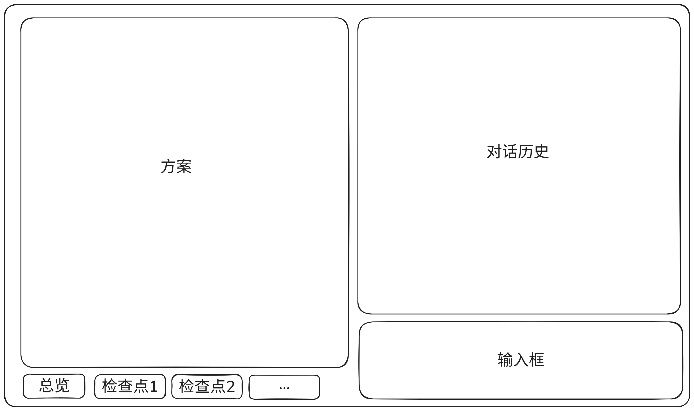

# 下一阶段产品改造

现有平台已经具备文件系统题目目录、公开检查点、运行时初始化、真实 `VerifyTask` 验证，以及自动完成的挑战工作台。下一阶段不再改动这些基础契约，而是解决两个产品问题：题目作者必须能审核 AI 实际生成的题目；做题用户必须能在卡住时获得与当前环境相关的帮助。

## 视觉与交互参考

新工作区明确参考 iximiuz Labs 的浅色、高信息密度、固定工作区设计语言：细分栏、紧凑顶部状态栏、稳定的主操作区，以及在同一视口内完成连续操作的节奏。它只作为布局和信息密度参考；不复制品牌、视觉资产、文案或 Discussion 等本项目没有产品价值的功能。


## 一、人工审核驱动的题目生成

### 目标

将当前“用户给出描述，agent 生成并自动进入真实验证”的单向流程，改为作者担任评审员的多轮流程。前置对话只形成自然语言的题意约定，作者不直接编辑题目代码。完整题目方案这一阶段以对应 `VerifyTask` 成功为起点：只有 generate agent 产出完整题目、并通过真实验证后，作者才能审核其文件、检查点和 diff；生成失败、构建失败或运行时验证失败的中间产物不进入作者工作区，也不形成需要作者处理的候选方案。

作者必须能在发布前看到当前已验证 revision 的：

- 题目场景、目标、限制、难度和运行时。
- 每个检查点的自然语言目标、可观察结果、提示与完成理由。
- `problem.md`、`solution.md`、`challenge.yaml`、Dockerfile、`generate.sh`、`checks/checkpoints.sh` 和 `answer.sh` 的只读内容。
- 本次 revision 相对于上一版本的文件差异，以及 agent 对改动原因和难度影响的说明。

### 产品原则

1. 用户描述题意和审核结果，agent 负责生成和修改题目资产；UI 不提供源码编辑器。
2. 检查点先由用户用自然语言表达，再由 agent 映射为可执行检查；不能只让用户在最终产物中被动发现检查规则。
3. 作者确认题意约定后，生成 artifact 必须自动进入真实 `VerifyTask`。作者不能审核未经真实验证的 artifact，也不需要处理其失败原因。
4. `VerifyTask` 失败时，结构化错误只交给 judge/generate agent；它们在同一持久 agent session 中修复并再次验证，直到产出通过真实验证的 revision。失败 revision、失败日志和修复过程仅保留为内部审计数据。
5. `VerifyTask` 成功只表示当前不可变 revision 已可发布，不得直接写入正式 challenge 目录或 catalog。作者审核通过后，才可以执行独立的“发布挑战”操作。
6. 作者对已验证 revision 提出任何修改后，修改后的 artifact 必须重新经过完整真实验证；不能复用旧 revision 的验证结果。
7. 已发布 challenge 继续以 `data/challenges/<id>/` 为唯一权威来源；作者会话、内部失败 revision 和已验证但未发布 revision 都不属于 catalog。
8. 生成或修订期间，若已有已验证 revision，作者工作区继续固定展示它；首次生成尚无已验证 revision 时，工作区只保留已确认的自然语言题意约定。新 artifact 只有在新的 `VerifyTask` 成功后才原子替换可见内容。不存在“让作者先看一份未验证具体实现、再决定是否修复”的路径。

### 作者流程

1. 作者创建一个 authoring session，输入粗略的题目描述。
2. review agent 在持久 session 中和作者多轮讨论，逐步形成可读的题意约定。作者可以逐项补充或纠正检查点的意图、环境边界和难度。
3. 作者点击“生成并验证题目”后，generate agent 生成完整 artifact，并可使用 `lab_*` 工具自行实验；Gateway 随后自动为它创建 `VerifyTask`。
4. `VerifyTask` 在真实发布环境中构建镜像、启动运行时初始化后的环境、执行 `answer.sh` 和全部检查点。它成功前，作者工作区不展示这份 artifact。
5. 验证失败时，Gateway 将结构化结果交给 judge/generate agent。agent 修复 artifact 后自动再次进入 `VerifyTask`；作者只会看到“正在生成并验证”，不会看到错误 artifact 或被要求手动修复。
6. 第一个通过 `VerifyTask` 的 revision 进入“等待已验证题目审核”，展示题目预览、检查点清单、只读文件和与上一已验证 revision 的 diff。
7. 作者可以用自然语言提出修改，例如“第二个检查点只验证服务可访问，不要要求固定的 systemd 文件名”。agent 将要求转化为内部修订并重新执行生成和真实验证循环；上一已验证 revision 保持可见，通过后才以新的已验证 revision 原子替换。
8. 作者确认当前已验证 revision 后点击“发布挑战”。Gateway 只提升该 revision 已验证的 artifact 与镜像，不重新生成、不重新验证，也不接受任意 artifact 上传。

### 状态机

```text
DraftConversation
  -> IntentReview
  -> GeneratingAndVerifying
  -> AwaitingVerifiedReview
  -> RevisingAndVerifying
  -> AwaitingVerifiedReview
  -> Publishing
  -> Published

GeneratingAndVerifying -- VerifyTask failed --> GeneratingAndVerifying
RevisingAndVerifying -- VerifyTask failed --> RevisingAndVerifying
```

`IntentReview` 和 `AwaitingVerifiedReview` 都是作者可停留、可多轮反馈的状态。前者展示的是自然语言题意约定，不是可运行题目的草稿；后者才开始完整方案审核，并且只展示已经验证的 artifact。验证失败是生成循环的内部转移，不产生作者可见的候选审核、失败事件或人工修复任务；在 `GeneratingAndVerifying` 或 `RevisingAndVerifying` 期间，`visibleVerifiedRevision` 不变。`Published` 是唯一会写入正式 challenge 目录和 catalog 的终态。

### 领域与存储边界

- `AuthoringSession` 保存作者身份、对话 session ID、当前状态、题意约定 revision、正在处理的 artifact revision、`visibleVerifiedRevision`、审核意见和审计时间线。它是应用会话数据，可以存数据库。
- 题目 artifact 保存到 `data/authoring/<session-id>/revisions/<revision>/`，并以 tarball 作为 agent job 与 Gateway 间的内部交接格式。只有通过验证的 artifact 才成为作者可见 revision；失败 artifact 放在独立的内部工作目录，不成为工作区内容或 diff 的一部分。
- `Generation` 承载生成、judge 修复与真实验证的循环。生成 artifact 后自动创建 `VerifyTask`，成功后才标记对应 revision 为 `Verified`。
- `VerifyTask` 继续只接受内部 agent workflow 交接的 artifact；不恢复任何用户上传 artifact 的公开入口。
- `VerifyTask` 负责真实验证，不负责发布。它成功后保留不可变的 artifact 引用、镜像引用和验证报告，供当前已验证 revision 使用。
- Gateway 的发布操作只接受当前 session 的 `Verified` revision；它原子将该 artifact 写入 `data/challenges/<opaque-id>/`、登记 catalog，并引用 `VerifyTask` 已构建的镜像。发布不触发新的生成或验证。

### 题意与已验证题目工作区

生成入口进入完整的 authoring 工作区，而非一次性的多步骤弹窗。页面固定占满视口，由左侧只读内容面板和右侧对话面板组成；对话是用户修改内容的唯一入口，左侧从不提供直接编辑能力。左侧在生成前展示题意约定，在验证成功后展示完整题目。该布局以 iximiuz 的浅色、紧凑、面向连续操作的工作台为参考，但不照搬其产品功能与视觉资源。



上图是工作区的信息结构布局草图，不是最终 UI 视觉稿：左侧是当前权威 revision，右侧是对话历史和固定输入区。它不是一次性的引导页，也不把题意约定、已验证题目、聊天和操作日志拆到不同页面；作者在同一视口内完成讨论、已验证题目审核和发布。

最终视觉应遵守以下约束：使用浅色页面、白色内容面与细灰色分割线；蓝色只用于主操作和明确的选中状态，绿色只表达成功状态。信息层级依赖布局、字重和留白，而不是渐变、大卡片或装饰性图形。桌面端的左右列宽保持稳定，窄屏才切换为“内容 / 对话”单面视图，不能压缩成彼此遮挡的两列。

#### 图中交互边界

示意图中的每个区域承担单一职责，避免在实现时把作者审核退化为普通表单：

| 区域 | 展示内容 | 作者能做什么 | 写入路径 |
| --- | --- | --- | --- |
| 顶部状态栏 | 暂定标题、当前 revision、生命周期状态、唯一确认操作 | 只执行当前状态允许的显式确认 | Gateway 启动生成验证循环或发布已验证 revision。 |
| 左侧内容面板 | 题意约定，或已验证资产、Diff 与成功验证摘要 | 阅读、切换 tab、定位某次变更 | 无。题目资产只来自服务端已经保存的当前已验证 revision。 |
| 右侧对话历史 | 作者反馈、agent 回复、已接受变更的 revision 卡片 | 阅读历史，点击变更卡定位左侧内容 | 无。消息本身不改变生命周期或题目资产。 |
| 右侧固定输入区 | 一条自然语言反馈 | 发送题意、澄清或修改要求 | Gateway 调用对话 agent；只有受控 function 成功后才产生新 revision。 |

因此，界面上的“修改”只有一条可追溯路径：作者在右侧说明意图，agent 调用受控 function，Gateway 原子保存新的题意约定 revision；只有产生完整题目资产时，左侧才在其 `VerifyTask` 成功后展示新的已验证 revision。agent 的普通文本回复、工具推理和作者未发送的输入都不是权威内容，也不能触发生成、验证或发布。

#### 原型落点

- 顶部是固定状态栏：左侧为暂定标题和当前 revision，中间为状态，右侧只保留当前状态允许的一个生命周期操作。
- 桌面端左侧为只读内容面板，默认约占工作区的一半；题意约定使用概览和检查点 tab，已验证题目审核时再出现 `Assets`、`Diff` 与 `验证`，不预先占用代码编辑区。
- 右侧是类似飞书的消息流：作者消息靠右，agent 消息靠左；已落盘修改以紧凑 revision 卡片附在对应 agent 消息下，点击后定位左侧内容。
- 输入区固定在右侧底部，只能提交自然语言。它与左侧的只读内容、顶部的确认操作共同构成三个清晰边界：讨论、阅读、发布门槛。作者反馈引起的任何题目修改都会自动重新生成并验证，不能绕过验证进入左侧。
- 整页始终锁定在视口内；仅左侧正文、消息列表、文件预览和 Diff 各自滚动。打开窄屏时切换单面视图，保留顶部状态和底部输入区，不保留横向挤压的双栏。

#### 顶部状态与唯一操作区

顶部标题栏横跨整个工作区，固定展示 challenge 暂定标题、当前生命周期状态、revision 与最后更新时间。它是状态的唯一来源，左侧正文不再重复放置状态或操作按钮。操作区在任一时刻至多显示一个会改变生命周期的命令：

| 当前状态 | 作者可见的唯一操作 | 结果 |
| --- | --- | --- |
| `DraftConversation` | 无，继续对话 | 题意约定尚未形成可确认版本。 |
| `IntentReview` | `生成并验证题目` | 锁定当前题意约定 revision，启动生成、judge 和 `VerifyTask` 循环。 |
| `GeneratingAndVerifying` | 无，显示正在准备已验证题目 | 不允许重复创建任务；内部失败自动修复并重试。 |
| `AwaitingVerifiedReview` | `发布挑战` | 原子提升当前已验证 revision 到正式 challenge 和 catalog。 |
| `RevisingAndVerifying` | 无，显示正在生成并验证修订题目 | 作者反馈已被接受，等待新的已验证 revision。 |
| `Publishing` | 无，显示发布中状态 | 固定的已验证 artifact 正在进入正式 challenge 目录和 catalog。 |
| `Published` | `查看已发布题目` | 只跳转或定位正式 challenge，不再允许在此 revision 上继续发布。 |

`生成并验证题目` 与 `发布挑战` 不是聊天快捷指令，也不由 agent function call 触发。作者每次点击命令都针对当前 revision；题意约定或已验证 revision 随后发生变化时，旧确认自动失效。

#### 左侧：当前权威内容

左侧展示服务端当前权威 revision 的只读内容，不展示尚未通过 function call 落盘的 agent 草稿，也不展示任何未通过真实验证的具体 artifact。`IntentReview` 中仅展示自然语言题意约定；只有进入 `AwaitingVerifiedReview` 后，Dockerfile、脚本和其他完整题目资产才会出现。底部使用 tab 在概览和检查点之间切换：

- `概览`：题目场景、目标、运行时、初始故障、范围、难度与整体解法方向。
- `检查点 1...N`：单个检查点的自然语言目标、可观察结果、依赖、提示方向和完成理由。
- 检查点数量较多时，tab 可横向滚动，并提供检查点总览菜单；不能因 UI 容量限制题目拥有的检查点数量。
- 进入已验证题目审核后，同一位置扩展为 `概览`、`检查点`、`Assets`、`Diff` 和 `验证`。`Assets` 只读展示实际文件，`Diff` 只对比两个已验证 revision，`验证` 只展示当前 revision 的成功阶段摘要。
- 左侧仅展示与当前 revision 对应的内容；顶部全局状态栏始终说明它是“题意约定 revision”还是“已验证题目 revision”，避免作者把描述草案误认为可发布 artifact。
- 页面本身不滚动。左侧正文、右侧消息历史和只读文件预览各自拥有独立滚动容器；输入框与生命周期操作区始终可见。

#### 右侧：对话与输入

右侧上半部分是可滚动的对话历史，下半部分是固定输入区，视觉采用简洁的即时通讯消息流：

- 用户消息靠右，agent 消息靠左；不使用大段营销式说明或额外功能卡片干扰讨论。
- agent 可以先提问澄清，也可以在理解明确后修改题意约定；不能把“我已经修改”仅作为口头承诺。
- 每次实际修改都在对应 agent 消息下附带紧凑的变更卡，说明修改了概览或哪些检查点、修改理由和 revision 编号。点击卡片可在左侧定位到变更内容或 Diff。
- 变更卡只展示已由服务端接受的 function call 结果；模型推理、工具参数和未落盘的草稿不作为用户可见的权威内容。
- 输入区只接受自然语言的题意、反馈和修改要求。用户不能在这里粘贴或编辑题目源码。
- agent 正在处理时保留完整历史和当前 revision，显示紧凑的进行中状态；发送按钮仅防止重复提交同一轮消息，不能以轮询或重载页面打断当前工作区。

“生成并验证题目”和“发布挑战”是会改变生命周期的显式命令，放在工作区固定操作区。它们不是内容编辑，因此不能仅凭 agent 在聊天中的一句话自动触发；用户必须明确点击确认。

### agent 工具调用与题意约定一致性

对话 agent 不直接写浏览器状态或任意文件。它只能调用受服务端验证的 authoring functions，函数成功后原子更新题意约定 revision，再将结果推送到两栏 UI：

```text
用户消息
  -> agent 读取当前题意约定 revision
  -> agent 回复或调用 authoring function
  -> Gateway 校验并写入新 revision
  -> 左侧刷新权威题意约定，或保持已有已验证题目并进入重新生成验证状态
  -> 右侧追加变更卡和自然语言回复
```

函数使用领域对象而非自由文件写入，至少包括：

- `replace_overview(markdown)`：修改概览的自由文本内容。
- `upsert_checkpoint(title, markdown, position)`：新增或修改一个检查点的自然语言说明。
- `remove_checkpoint(id)` 与 `reorder_checkpoints(ids)`：调整检查点结构。

检查点主体使用自由 Markdown，不强制 `expected_user_edits` 这类会限制题目多样性的字段。稳定结构只保留检查点身份、标题和顺序。每次调用携带 `intent_version`，防止旧上下文覆盖用户已经确认的新版本；服务端同时保存调用参数、修改理由和前后 revision，用于审计和 Diff。

agent 没有“生成”“真实验证”“发布”这类 lifecycle function。它可以在回复中建议作者进入下一阶段，但只有作者能显式启动首轮生成验证或发布：

```text
IntentReview 中的 agent 修改题意约定
  -> 服务端写入 revision
  -> 作者阅读左侧权威内容与 Diff
  -> 作者点击“生成并验证题目”
  -> Gateway 启动 Generation 和 VerifyTask 循环

AwaitingVerifiedReview 中的作者反馈
  -> agent 记录修订意图并写入题意约定 revision
  -> Gateway 自动启动 Generation 和 VerifyTask 循环
  -> 只有新的 VerifyTask 成功，左侧才切换到新已验证题目 revision
```

因此，聊天消息既不是初始生成或发布的隐式确认，也不能通过 prompt injection 触发发布。已验证 revision 上的自然语言修改请求只能触发受控的重新生成验证循环，不能绕过 `VerifyTask` 直接改变作者可见的 artifact。每次发布都锁定当时的已验证 revision；后续对话产生新的 revision 后，旧发布确认自动失效。

### 已验证 revision 审核

第一个通过真实验证的 artifact 不切换到另一套产品模型，而是复用同一工作区：左侧从题意约定 tab 切换到实际题目资产、与上一已验证 revision 的 diff 和成功验证摘要，右侧继续保留完整对话。作者仍只能通过自然语言要求修改；agent 生成的每个新 artifact 都先经过真实验证，成功后才替换左侧当前 revision。

真实验证中的进度可在右侧显示为“正在生成并验证”，成功后记录验证完成事件。失败诊断、失败 artifact 和自动修复轮次不展示给作者；它们只作为 judge/generate 的内部输入及服务端审计数据。作者不会被要求对错误题目作出审核，也不会看到自动重试发布。

### 修订与可追溯性

- 题意约定 revision、内部 artifact revision、已验证 artifact revision、作者消息、agent 消息和显式确认事件均为追加式记录；页面只把当前已验证 revision 作为默认 artifact 视图，不覆盖历史。
- 每个已验证 artifact 必须明确标注它基于的题意约定 revision 和成功 `VerifyTask`。已验证 revision 之间必须保留可读 Diff，不能只显示最终压缩包。
- 验证报告绑定到它验证的 artifact revision。失败报告只作为下一轮 judge/generate 的输入和内部审计，不会成为作者可见 revision；成功报告是当前已验证 revision 的不可变证明。
- 发布完成后，authoring session 只显示发布结果和正式 challenge 引用；正式题目仍由 `data/challenges/<opaque-id>/` 决定，不从 authoring 数据库反向重建。

### 验收标准

- 作者可以至少两次修改题意约定和至少一次已验证题目；每次修改后的 artifact 都只能在通过 `VerifyTask` 后显示为新的 revision 和 diff。
- 作者点击“生成并验证题目”后，Gateway 自动创建 `VerifyTask`；未经验证成功的 artifact 不会出现在工作区、正式目录或 catalog。
- 真实验证失败时，系统自动将结构化错误交给 judge/generate 并重新验证；作者不看到失败 artifact，也不能发布它。
- 当前已验证 revision 只有在作者点击“发布挑战”后才进入 `data/challenges/<opaque-id>/` 和 catalog；发布操作不重新生成或验证。
- 已发布题目可像手写题一样完成真实 container 或 vcluster 验证，并在工作台自动完成。

## 二、基于终端上下文的做题助手

### 目标

在挑战工作台中提供一个 AI 助手。用户卡住、检查点不通过或命令结果异常时，可以询问当前应该排查什么、为什么失败、下一步应执行什么命令。助手基于当前题目、检查点和用户自己的终端上下文回答，而不是给出脱离现场的通用建议。

### 产品原则

1. 助手默认是只读顾问：不执行命令、不改文件、不创建 Kubernetes 资源，也不向用户终端注入任何输入。
2. 用户主动提问时才向模型发送上下文；平台不能把持续终端流量自动上传给模型。
3. 回答应优先解释失败检查点、可观察现象和排查方向；用户可以显式要求更具体的命令或完整解法。
4. 助手必须和当前用户、当前环境、当前挑战严格绑定，不能读取其他用户的终端、检查点或会话。
5. 终端记录只保留到对应环境被清理；用户应能看见将要发送给模型的上下文摘要。

### 终端上下文模型

WebSocket 输入本质上是按键流，不能可靠地直接等同于“执行过的命令”。因此需要区分两类本地数据：

- 终端 I/O 滚动记录：每个 tmux window 保留有限长度的输入与可见输出，用于解释刚出现的报错。
- Bash 命令日志：通过 shell 初始化 hook 记录交互命令、工作目录、时间和退出码，形成可读的命令历史。

助手请求时再组合以下上下文：

- `problem.md`、检查点定义、当前检查点结果和错误详情。
- 最近相关的命令日志和终端输出窗口。
- 当前 terminal window、runtime 与环境状态。
- 用户本次问题和本次会话的简短对话摘要。

这能可靠覆盖平台默认 Bash 中的交互命令。任意程序内部派生的每一个进程执行不属于承诺范围；若未来确有需求，需要单独设计主机级审计能力，不能假装 WebSocket 按键流可以完整解决该问题。

### 隐私与安全

- 命令和输出先只保存在用户环境的本地会话记录中，不直接进入 LLM。
- 发起提问时，Gateway 按长度上限裁剪上下文，并过滤常见 secret、token、私钥、kubeconfig 和环境变量值；UI 显示将发送的摘要。
- Assistant conversation、终端上下文和模型调用都按 `user + environment + challenge` 进行授权。
- 环境清理时删除对应 transcript、命令日志和助手会话；不得把它们写入已发布 challenge 目录。
- 模型 system prompt 明确禁止声称已执行操作，并要求将建议关联到具体检查点或观察到的输出。

### API 与运行时边界

- Gateway 在现有 tmux/PTY 转发旁维护本地 transcript 元数据，不改变浏览器的键盘输入路径。
- Gateway 增加受认证保护的 assistant conversation 接口，响应使用流式事件返回，便于显示生成中的回答。
- Gateway 读取 controller 的检查点状态快照，而不是为了助手额外运行检查脚本。
- 初期 assistant 不拥有环境 exec 工具。后续若引入主动诊断，只能增加经过用户授权的只读检查工具，并和终端输入完全隔离。

### UI 与交互

- 工作台顶部或终端区提供 Assistant 图标，打开不影响现有 Problem、Solution、检查点和终端布局。
- 抽屉展示对话、上下文摘要和引用来源，例如“基于检查点：Deployment 可用性”和“最近命令：kubectl get pods”。
- 常用入口包括“为什么这个检查点未通过”“解释最近错误”“建议下一步排查”。它们只是预填问题，仍由用户确认发送。
- 助手回复可以包含建议命令，但必须由用户自行输入终端；不提供一键执行。

### 验收标准

- 用户完成若干命令后，助手能引用当前失败检查点和最近终端输出，给出与题目相关的排查建议。
- 助手请求不会修改环境，终端收到的键盘数据与未启用助手时完全一致。
- 切换用户或挑战时，无法读取此前环境的 transcript、命令日志或会话。
- 输入中包含模拟 token、kubeconfig 或私钥片段时，发送给模型的上下文不包含原始敏感值。
- 环境 Stop、Reset 或自动清理后，对应助手数据被清理且不可继续访问。

## 推荐实施顺序

先完成第一部分。它会重塑 `Generation` 的状态机、已验证 artifact 边界和发布门槛，是后续所有生成题质量保证的前提。第二部分可在稳定的工作台与检查点快照之上独立接入，先实现只读上下文助手，再评估是否需要受控的主动诊断能力。
