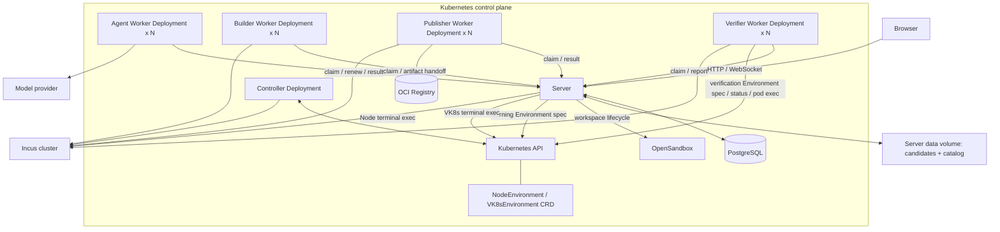
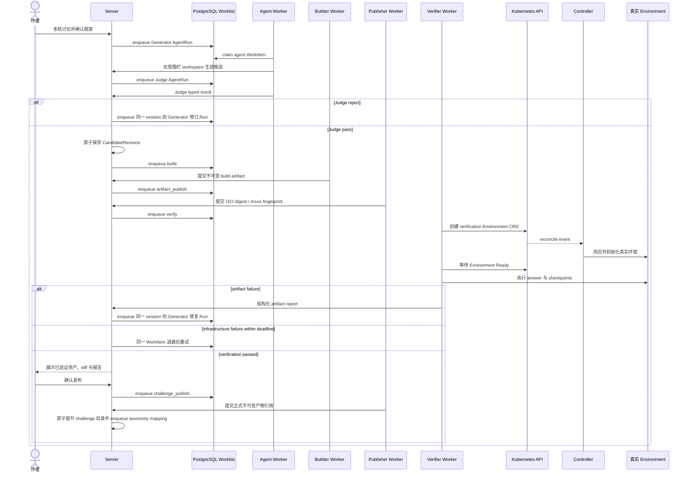
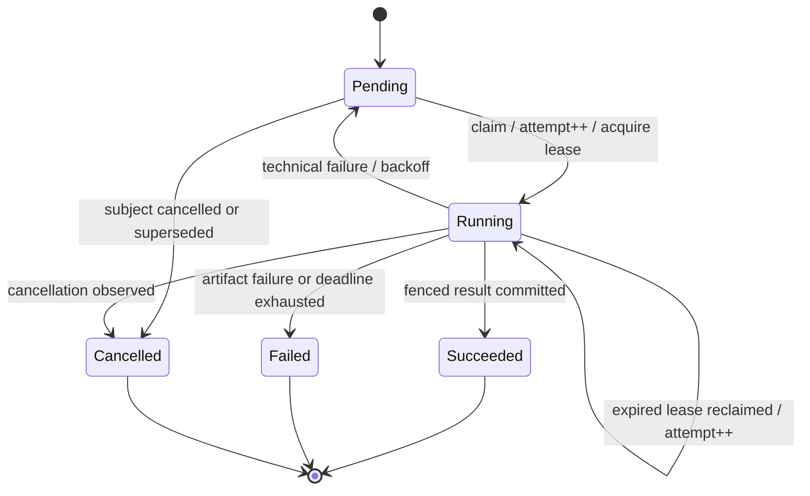

# 下一阶段：运行时与工作流重构

这是开发期的破坏性迁移，不兼容 `ContainerEnvironment`、`VClusterEnvironment`、`container/vcluster`
runtime、旧的题目目录布局或旧数据库记录。目标只有两件事：用准确的运行时模型提供真实实验环境；用 Server
持久 worklist 和固定容量 worker pool 调度生成、构建、发布和验证。

## 一、运行时模型：NodeEnvironment 与 VK8sEnvironment

### 边界与用户模型

- `runtime: node` 对应 `NodeEnvironment`：一组真实 Linux 节点实验。每个逻辑节点是 Incus 创建的
  unprivileged system container，以 systemd 为 PID 1。用户可以进入全部节点，真实使用
  `systemctl`、`journalctl`、SSH、网络工具和普通 shell。
- `runtime: k8s` 对应 `VK8sEnvironment`：一个隔离 Kubernetes 管理实验。底层是 vcluster；用户进入唯一的
  管理终端，终端持有 vcluster kubeconfig，通过 `kubectl` 管理虚拟集群。
- Incus 和 vcluster 只是平台实现，绝不出现在 challenge manifest、作者提示、浏览器 API 或用户界面中。不能
  引入 `runtime.class`、`runtime.backend`、Provider 名称等泄漏实现的字段。
- NodeEnvironment 没有 Pod、Service、kubeconfig、ServiceAccount 或 vcluster。VK8sEnvironment 没有供用户登录的
  Kubernetes worker node。真实 VM、宿主节点、内核模块、CNI 和节点级故障不在当前范围；未来需要 VM 语义时，新增
  独立的 `VMEnvironment`，底层仍使用 Incus VM，不把它伪装成 NodeEnvironment。

### 部署与 Provider

日常开发保留本机 Kind；PVE 上的单成员 Incus cluster 是可插拔 Node provider：

```text
开发机 Kind
  Server / Controller / Agent Worker / Builder Worker / Publisher Worker / Verifier Worker
  PostgreSQL / Registry
                    |
                    | mTLS Incus API
                    v
PVE 上 incus-1 VM
  单成员 Incus cluster
    NodeEnvironment system containers
```

生产可以是 `ACK + Incus ECS pool` 或 `K3s + Incus ECS pool`。Kubernetes 与 Incus 位于同一私网 VPC、使用独立
ECS 池和安全组；一个 Environment 只获得 Incus Project、逻辑网络和实例，不创建云 VPC 或 ECS。浏览器不直连
Incus，Server 代理 Incus exec WebSocket；Incus API 仅监听私网并使用 mTLS。Server、Controller、Builder、Publisher
和 Verifier 按各自职责挂载不同的客户端证书，不能共享一枚全能证书；凭据只供受信任平台二进制使用，不会进入候选
脚本、Generator Sandbox 或用户/验证环境。

### K8s OCI Registry

K8s candidate 和正式 challenge image 使用正常的 HTTPS OCI Registry 路径，而不是节点预加载或 Controller 代理。根部署包默认
提供内置 Registry：运营方选择仅内网可解析的稳定名称，例如 `registry.breakfix.internal`，将它解析到私有 LoadBalancer，并提供
由运营方内部 CA 签发的 `breakfix-registry-tls` Secret。CA 根证书由集群管理员预装到所有会拉取镜像的节点；Server 与 Publisher
通过可选 `breakfix-registry-ca` ConfigMap 追加同一公开根证书。Breakfix 不生成或轮换根 CA，不安装 cert-manager，不依赖公网 DNS，
也不修改 `/etc/hosts`、CoreDNS、containerd `config.toml` 或 `hosts.toml`，更不会重启 containerd。不能用 `*.svc`/ClusterIP
作为镜像引用。

外部 Registry 是一等部署模式：`deploy/overlays/external-registry` 删除内置 Registry Deployment、Service 和 PVC，使用
`registry.address` 指向 Harbor、云厂商 Registry 或其他 HTTPS OCI endpoint。两种模式共享相同的 Build、ArtifactPublish、Verify
和 immutable digest 语义；不同之处只有 endpoint、认证和 CA bootstrap，不产生另一套工作流。

Registry 是否需要凭据由其授权策略决定；私有 project 的 Kubernetes 标准做法是 Docker pull Secret。`registry.pull_secret`
非空时，Controller 将控制 namespace 中的 pull Secret 复制到每个 VK8s Environment namespace，并创建禁用 API token 自动
挂载的 `breakfix-runtime` ServiceAccount 绑定它；为空时只创建同一个无 token、无 pull Secret 的 ServiceAccount。terminal Pod
只设置 `serviceAccountName: breakfix-runtime`，不显式携带 `imagePullSecrets`，也不挂载 Secret。Publisher/Server 的 Registry
客户端凭据不进入 Builder、Verifier、用户环境或 challenge image。需要 repository-scoped pull/push 权限时由 Registry 授权后端实现，
例如 Harbor robot account；Breakfix 不伪造一套镜像授权协议。

Incus 7.0 的 restricted certificate 只能配置精确 Project 列表，不能按动态 Project 名前缀授权。初始实现不在每次
Environment 创建/删除时修改 trust store：Builder 可限制到固定 build Project，Publisher 可限制到固定 build 与
image Project；Controller、Server 和 Verifier 因为需要访问动态 Environment Project，使用彼此独立、可单独轮换和
撤销的平台证书，平台代码只接受从 Environment UID 派生的 Project/instance。这个边界依赖受信任平台进程，不伪装成
Incus 原生细粒度授权；未来若要求 Provider 级最小权限，应新增独立 Incus Provider API，而不是把 trust-store 协调
散落进业务代码。

当前只支持单成员 Incus provider 和 `bridge` 网络驱动。Provider 不可用时，新的 NodeEnvironment 必须明确报告
`ProviderUnavailable`，不能创建半成品资源，也不得影响 VK8sEnvironment。未来扩展多成员时只切换到预先运维好的
`ovn`：Controller 不传 Incus `target`，由 Incus 自动放置实例，OVN 负责同一 Environment 跨 member 连通；不实现
自定义 member scheduler。Incus 默认 placement 只按实例数而非 CPU/内存 bin packing，因此启用多成员 OVN 前，
eligible member 必须同构，Node 使用平台固定的每节点资源档位。

不采用 Sysbox、Kata、KubeVirt、特权 DaemonSet 或 hostPath cgroup 挂载。普通 Pod 无法提供真实 systemd 所需的
系统容器语义；Incus system container 提供 user namespace、delegated cgroup 与完整 rootfs，且不需要嵌套虚拟化。

### Incus SDK、配置与开发基线

运行时实现直接使用 Incus 官方 Go SDK，固定依赖 `github.com/lxc/incus/v7@v7.0.1`，客户端包为
`github.com/lxc/incus/v7/client`，API 类型来自 `github.com/lxc/incus/v7/shared/api`。该版本与当前开发集群的 Incus
`7.0.1` 对齐；升级 SDK 或 Server 必须显式修改版本并重新运行真实契约测试，不能使用未固定的 latest。平台进程不能
shell out 到 `incus`，也不能读取 `~/.config/incus`、当前 remote 或本机客户端证书；CLI 只用于运维引导和人工诊断。

SDK 适配集中在 `internal/incusprovider/`，不新建公共 `pkg/`，也不把 `incus.InstanceServer` 或 `api.*` 类型泄漏到领域层。
连接层使用 `ConnectIncusWithContext` 和显式 `ConnectionArgs` 构造基础 mTLS client，强制校验 Server certificate/CA，
禁止 `InsecureSkipVerify`。官方 `InstanceServer` 接口没有列出、但 HTTPS 实现提供 `WithContext`；provider 构造时对这一
能力做一次受检查的接口断言，每个操作先 `WithContext(ctx)` 浅拷贝 client、再经 `UseProject` 选择 Project，从而复用
HTTP transport 且让同步请求也受调用方取消控制。Project、network/ACL、profile、instance、file、exec、image 和 alias
操作由 provider 转成 Breakfix 自己的 typed request/result。所有异步 `Operation` 都用同一调用方 context 执行
`WaitContext`；同一 Incus Server 内跨 Project 复制 image 使用目标 Project 上的 `CreateImage`，并在
`ImagesPost.Source` 中明确 source fingerprint 和 source Project，不使用缺少 context wait 的远端复制流程。context
取消时 provider 请求取消 operation，并按确定名称重新观察最终资源；即使服务端操作已经不可取消，接管者也能识别并
清理其结果，不能把客户端返回当作远端副作用已经停止。

Provider 按消费方暴露小接口，而不是一个可任意操作 Incus 的通用门面：Controller 只得到 Environment
create/observe/delete，Server 只得到 terminal attach/resize，Builder 只得到 build instance/file/image，Publisher 只得到
image copy/alias/delete，Verifier 只得到 verification exec。生产实现共享连接和错误映射；各消费包在自身边界定义测试
接口。名称全部由 opaque ID/UID、WorkItem attempt 和固定前缀确定性派生，并写入 `user.breakfix.*` 元数据；create-or-get
只有在 owner、revision 与期望配置完全一致时才接管，否则报告 invariant breach。删除始终使用数据库/CRD 已记录的精确
Project、instance、alias 和 fingerprint，不按前缀扫描删除。Provider 只按 Incus typed response、HTTP status 和 operation
metadata 区分 NotFound、Conflict、Unavailable 与 Invalid，不匹配 CLI 文本或 stderr。

Node terminal 也完全走 SDK：Server 对目标 Project/instance 调用 `ExecInstance`，以交互 PTY 执行固定的
`tmux new-session -A` 命令，通过 `InstanceExecArgs` 转发 stdin/stdout 和 control WebSocket 的 resize/signal。浏览器连接
关闭只取消本次 attach，tmux session 留在该节点；Environment 删除才终止 session。检查点、answer 和 runtime-init 状态
探测使用非交互 exec 并分别捕获 stdout/stderr，不能复用用户 tmux，也不能把 terminal stream 当作任务日志。

配置统一收敛为一块，不把本机 remote 写进共享配置：

```yaml
incus:
  endpoint: https://incus.internal.example:8443
  tls:
    server_certificate_file: /var/run/secrets/breakfix-incus/server.crt
    client_certificate_file: /var/run/secrets/breakfix-incus/client.crt
    client_key_file: /var/run/secrets/breakfix-incus/client.key
  storage_pool: local
  network_driver: bridge
  build_project: breakfix-build
  image_project: breakfix-images
  base_image_alias: node-systemd-base-v1
  base_image_fingerprint: <full sha256 fingerprint>
  name_prefix: bf
  max_nodes_per_environment: 4
  node_cpu: "1"
  node_memory: 512MiB
  node_processes: 512
  node_root_disk: 5GiB
  # Dedicated, unallocated RFC1918 range. The Controller deterministically
  # assigns one unused /24 bridge subnet to each NodeEnvironment.
  node_network_pool: 10.240.0.0/16
  node_network_prefix: 24
  blocked_egress_cidrs:
    - 10.0.0.0/8
    - 100.64.0.0/10
    - 169.254.0.0/16
    - 172.16.0.0/12
    - 192.168.0.0/16
```

每个需要 Incus 的 Deployment 挂载自己的 mTLS Secret，但使用相同文件路径；Secret 内容不进入 ConfigMap。Builder
certificate 只允许 build Project，Publisher 只允许 build 与 image Project；需要动态 Project 的三个平台进程使用彼此
独立的证书。worker 副本数、Pod CPU/内存和临时存储仍属于 Deployment overlay，不进入业务请求或该配置块。迁移同时
删除 `agent_database_url`、`agent_database_role`、`verification_grant_key`，以及旧 Controller 用来创建临时 Job 的
`builder_image`、`publisher_image`、`verifier_image`；固定 Worker Deployment 自己声明镜像。

Node provider 预检按角色验证：API 与 mTLS 可用；Server version/API extension 满足项目、限制、独占网络授权、network
ACL、跨 Project image source、instance exec/file 和 operation wait；bridge 模式下恰有一个 Online member；`local` storage
pool 存在且可用；固定 build/image Project 的配置符合预期；配置的 base alias 与完整 fingerprint 指向同一 container
image。预检只读，不偷偷修复全局资源。它不是 Kubernetes `/readyz` 的全局门槛：Incus 不可用时，Server、Controller 和
固定 Worker 必须继续处理 VK8s 及不依赖 Incus 的工作。Server 与 Worker 在 `/capabilities/node-provider` 暴露 live
preflight；Controller 在每个 Node reconcile 前经 provider 预检，并将失败写入该 NodeEnvironment 的
`ProviderUnavailable` condition。Controller 创建动态 Project 前再次做轻量 provider check，避免留下半成品。

固定 Project、证书和不带过期时间的 `node-systemd-base` 由显式、幂等的运维 bootstrap 建立，不由 Controller 启动时隐式创建。提交题库中的 Node challenge 则由显式 catalog seed 工具先规范化为与 Generator 相同的候选 bundle，再复用 Incus Build、ArtifactPublish 与 ChallengePublish 原语发布为正式 image；题目目录同步依赖这一步，不能靠人工预置或只复制 manifest。基础镜像
从 Incus 默认 `images:` 服务的 `ubuntu/24.04` x86_64 container image 开始，bootstrap 先把解析出的上游 fingerprint
锁定，再运行仓库内受信任的基础镜像脚本，安装 tmux 与平台 runtime-init unit，验证 systemd/cgroup/exec 后停止并发布
版本化 alias，最后输出完整 fingerprint 供配置更新。任务执行不依赖外部 image server；候选 `generate.sh` 也不会参与
基础镜像构建。bootstrap 为 build Project 创建独立 profile、root disk，并在 `default` Project 创建仅供基础镜像构建
使用显式、运维配置的固定 CIDR NAT bridge；build Project 通过 `restricted.networks.access` 只获得该 bridge。这个 CIDR 与
`node_network_pool` 分离，bootstrap 拒绝接管配置不同的同名 bridge。image Project 只保存
`public=false` 的 candidate/正式 images 与 aliases。两者启用独立 image/profile/storage feature，并设置
`features.networks=false`，因为 Incus 7.0 明确只允许 OVN network 存在于非 default Project。bootstrap 不修改
`default` profile 或物理网络，但 bridge 模式必须在 `default` Project 保存平台拥有的 opaque bridge/ACL。bootstrap
可以使用本机 CLI，但应用运行时和测试主体必须经过 Go provider。

截至 2026-07-29，本机已经具备真实集成测试基线：默认 CLI remote 为 `incus-cluster`，Client/Server 均为 `7.0.1`；
cluster 只有一个 x86_64 member `server1`，状态为 Online/Fully operational；存储池为 Btrfs `local`。集群当前没有实例、
managed network 或本地 image，因此首次验收前必须先执行上述 bootstrap。测试和 bootstrap 不得修改 `default` profile，
也不得修改或接管物理 `eth0`、`eth1`；本机 remote endpoint 与 `~/.config/incus` 证书只是开发者配置，不提交为应用配置。

### NodeEnvironment 的隔离、网络与节点名称

Incus Project 是一个 NodeEnvironment 的租户边界。Controller 为每个 Environment 建立由 UID 派生的 Project 和
runtime profile，并在 `default` Project 建立该 Environment 独占的 network/ACL；用户、题目脚本和浏览器没有 Incus API 凭据。

- Project 使用 `restricted=true`，启用独立的 `features.images`、`features.profiles` 与 `features.storage.volumes`，并设置
  `features.networks=false`。Incus bridge 不支持非 default Project；Controller 在 `default` Project 创建每个 Environment
  独占的 opaque bridge/ACL，再通过 `restricted.networks.access=<exact network>` 只授权该 Environment Project。
  Controller-owned profile 设置 `security.privileged=false`、`security.idmap.isolated=true`
  和 root disk，禁止 raw LXC、nesting、host path/device、proxy device、snapshot 与 backup；Project/profile 同时设置
  CPU、内存、进程、磁盘和实例总量限制。
- Controller 先从固定 image Project 按完整 fingerprint 复制且只复制当前 revision 的 image 到 Environment Project，
  再从 Project-local fingerprint 创建实例；Environment 不连接外部 image server。删除时按 instance、image、profile、
  Project、default Project 中的 ACL 与 network 的明确顺序收敛，不使用 `DeleteProjectForce` 掩盖残留资源。
- 每个 Environment 获得独占 managed bridge。Controller 从配置的专用 RFC1918 地址池中按 Environment UID 的稳定哈希起点选择未与任何已有
  Incus IPv4 bridge 重叠的固定子网，例如 `10.240.37.1/24`；创建竞争时重新观察所有 bridge 并继续探测。已创建 bridge 的网关地址是重调和时
  的唯一事实来源，必须仍落在配置池和指定 prefix 内。bridge 启用 IPv4 NAT 并关闭 IPv6，位于 `default` Project，但名称和 owner metadata 都由
  Environment UID 派生，且只授权给该 Environment Project；它们不是多租户共享网络。Controller 创建并绑定 network ACL：同一 bridge 内节点互通不经过该边界；出站先拒绝平台配置的私网、宿主网络、CGNAT 和
  link-local/metadata CIDR，再允许公网与已建立连接；入站默认拒绝。节点 NIC 开启 IPv4 source filtering，防止地址欺骗。
  不创建 network forward、proxy device 或其他入站暴露；不同 Environment 必须双向不可达。
- Project 不是 Linux network namespace，多个 bridge 不能复用同一 gateway CIDR。Controller 为节点 NIC 固定分配
  地址，例如 `.10`、`.11`、`.12`，并把逻辑拓扑作为 credential 注入每个实例：

  ```text
  10.42.0.10 client
  10.42.0.11 proxy
  10.42.0.12 app
  ```

  `node-systemd-base` 的平台 init unit 在运行节点 `generate.sh` 前写入平台托管的 `/etc/hosts` 段。题目、答案、
  检查点和用户只使用 `client`、`proxy`、`app` 等逻辑名称，不使用 IP、`*.incus`、Incus instance/member 名称或
  Kubernetes 资源名。用户自行修改 `/etc/hosts` 是正常做题行为，不是隔离边界。

初始 Node 题只有一张隐式私网。未来多网段题通过 manifest 中受校验的 `networks[]` 和节点 `interfaces[]` 声明；
Controller 创建 provider network 并按声明连接 NIC。bridge 下全部网络位于唯一 member，OVN 下是独立 logical
network。网络 ACL、路由、IP 与 NIC 始终由平台生成，用户不能通过脚本操作 Incus network。

### Challenge 资产与运行时初始化

challenge 目录是公开题库的可读资产。运行时、节点拓扑和检查点位置由 `challenge.yaml` 显式声明，不允许脚本动态
猜测平台结构。

Node manifest 的核心形态：

```yaml
runtime: node
nodes:
  - name: client
    title: Operator client
  - name: proxy
    title: Reverse proxy
  - name: app
    title: Application host
checkpoints:
  - id: application-reachable
    title: Reach the application through the proxy
    description: ...
    hint: hints/application-reachable.md
    node: client
```

- 节点 `name` 是稳定逻辑名称，唯一且不能使用平台保留名称；`title` 只用于终端选择器。所有声明节点都可进入，没有
  workspace、入口节点或 `terminal: false` 特例。
- checkpoint 必须声明执行节点。checkpoint 没有前置依赖或通过顺序，数组顺序只用于 UI 展示。
- Node 资产按节点存放：

  ```text
  nodes/client/generate.sh
  nodes/client/answer.sh
  nodes/client/checks.sh
  nodes/proxy/generate.sh
  nodes/proxy/answer.sh
  nodes/proxy/checks.sh
  ```

  每个节点都有 `generate.sh` 与 `answer.sh`；有 checkpoint 的节点必须有 `checks.sh`。无操作节点使用显式成功的空
  脚本。脚本只操作自身节点，不能根据环境变量替其他节点创建状态。
- K8s 题独立使用 `k8s/generate.sh`、`k8s/answer.sh`、`k8s/checks.sh`，不得在 Node 脚本中使用 Kubernetes API、
  vcluster、kubeconfig 或 Incus API。

所有题目均采用运行时初始化。基础镜像只包含 Ubuntu、systemd（Node）、tmux、APT 和常用 shell/网络诊断工具。
`generate.sh` 可以安装题目专属软件并构造错误初态，例如 Node 题安装 Nginx 后写入错误 virtual host，或 K8s 题
在管理终端安装工具并创建初始 workload。不要引入 `packages.txt`，也不让构建期联网安装软件。

Node Builder 从已经包含平台 runtime-init unit 的 `node-systemd-base` 制作只新增 challenge bundle 的不可变 Incus
image；每个实例首次启动时只运行自身 `nodes/<name>/generate.sh` 并写入 sentinel。K8s Builder 制作包含 bundle 的 OCI image；
管理终端启动时运行 `k8s/generate.sh`。两类 Builder 都不执行 `generate.sh`。验证与用户环境均使用同一 staging
产物，因此验证证明的是运行时初始化后的真实环境，而不是构建阶段的模拟状态。

Node 的全部 `generate.sh` 与全部 `answer.sh` 可并行执行，没有节点顺序契约；需要远端依赖时，脚本自行等待可观察的
就绪条件。Node 的 `checks.sh` 由 Controller 在对应节点无参数执行，stdout 只输出该节点 checkpoint 的结构化 JSON
结果；逻辑未通过输出 `passed: false` 且退出 0，协议/执行错误才以非 0 退出。VK8s 在管理终端执行唯一的
`k8s/checks.sh`，遵循相同 JSON 协议。

### Controller 职责、快照与验收

Controller 只调和 `NodeEnvironment` 与 `VK8sEnvironment`，不拥有生成、构建、发布或验证状态机：

1. Node Controller 检查 Incus provider 和 snapshot 中的 image fingerprint，创建 Project，把 image 从固定 image Project
   复制到该 Project，再创建 network、profile、稳定地址和拓扑 credential，最后创建全部节点实例。全部 runtime-init
   完成才进入 Ready；任一 member/provider 失败写入明确 condition，不伪造恢复。
2. VK8s Controller 创建专属 namespace、隐藏 vcluster 与管理终端，等待 kubeconfig 和 `k8s/generate.sh` 初始化成功后
   进入 Ready。
3. Environment spec 有平台内部的 `purpose: learning|verification`，它不属于 challenge manifest，也不返回给作者。
   学习环境由 Controller 周期执行检查点，并把首次通过时间、最近检查时间、详情和执行错误写入 status；全部通过则
   自动 Completed，没有用户可见 Submit。验证环境只由 Controller 供应和清理，不能自动执行检查点；Verifier 在答案
   完成后单次执行同一套检查脚本，避免 Controller 与 Verifier 并发改变环境或重复判定。
4. Controller 负责 Environment finalizer 与 deadline 回收。终端断开、worker 崩溃或验证中断不能留下 Incus instance、
   network、project、vcluster、namespace、kubeconfig 或 exec session。

Environment status 使用结构化 condition 区分 `failureClass: artifact|infrastructure` 和稳定 reason。Provider、网络、
镜像拉取、Project/namespace/vcluster 创建以及候选脚本启动前的失败属于 infrastructure；候选 `generate.sh` 一旦开始
执行，其非零退出属于 artifact。平台不能通过 stderr 关键词猜测 APT 故障或脚本错误；若未来要细分，必须增加显式
运行时协议，而不是加入日志兼容规则。

Controller 从 Environment spec 的不可变快照工作，不在运行时读取 challenge 目录。学习环境引用已发布 challenge
revision；验证环境引用 CandidateRevision。两者的快照都包含 checkpoint ID、节点和执行位置；Node 还包含 Incus
image fingerprint、profile revision、网络策略、固定节点资源和拓扑；VK8s 还包含 OCI image digest、vcluster 配置
revision 和管理终端约束。Controller 只消费这些值，不解析 CandidateRevision 或公开题目目录。

完成本部分前必须有真实验收：单成员 Incus bridge 上两个隔离 NodeEnvironment 可以复用逻辑节点名但不能互通；三节点
`client -> proxy -> app` 反向代理题真实运行 systemd、APT、Nginx、`systemctl` 和 `/etc/hosts`；VK8s 仍可通过
管理终端操控 vcluster；provider 断开时只影响新 Node 环境；多成员只在未来配置 OVN 后单独验证自动 placement 与跨
member 连通。

## 二、Server Worklist 与固定 Worker 工作流

### 总体架构与唯一所有者

固定 worker pool 下，旧 `VerifyTask` CRD 没有独立价值：它曾经只是 Controller 为每个候选创建并轮询 Builder、
Publisher、Verifier Job 的状态机。继续保留它会让 CRD status 与 PostgreSQL worklist 两次表达同一件事。本次迁移
删除 `VerifyTask` CRD、reconciler、三个按任务创建的 Job 及其 RBAC、generated code、测试和兼容路径。

新架构只有两类持久控制对象：Server/PostgreSQL 中的领域对象与 WorkItem，以及 Kubernetes API 中的 Environment
CRD。前者决定“做什么、做到哪一步”，后者只表达“供应一个什么样的真实环境”。



组件所有权如下：

| 组件 | 唯一职责 | 明确不拥有 |
| --- | --- | --- |
| Server | 领域状态、CandidateRevision、worklist、租约、artifact、作者发布 | 不执行模型、构建脚本或环境调和 |
| PostgreSQL | 领域记录与 WorkItem 的事务权威 | 不保存正式 challenge 内容或大体积 artifact |
| Controller | Environment spec 到真实 Kubernetes/Incus/vcluster 资源的调和、status、finalizer、deadline | 不访问 PostgreSQL、候选归档或工作流阶段 |
| Worker | 领取并执行一个明确阶段，通过 Server 提交结果 | 不直接写 PostgreSQL，不自行推进下一阶段 |
| Server data volume | 未发布候选归档与已发布 challenge 目录 | 不保存队列、租约或用户状态 |

Server 是唯一数据库写入者。包括 Agent Worker 在内的所有 worker 都经 Server 内部 API 领取和提交任务，不再直接持有
PostgreSQL 凭据。多 Server 副本以后只需共享 PostgreSQL 与 artifact storage；当前 RWO data volume 和单 Server
Deployment 的限制不在本次顺带解决。

### 领域对象与数据边界

本设计只需要三个明确对象，不引入 Workflow CRD 或第二套阶段表：

- **AgentRun**：一次 Authoring、Generator、Judge、Assistant 或 Taxonomy 模型调用的领域输入与结果。它保留 session、
  message、typed result 和 deadline，但不再保存 attempt、lease owner 或 next-run-at；这些调度字段只属于 WorkItem。
- **CandidateRevision**：Judge 已通过、即将自动进入真实流水线的一份不可变题目候选。它保存 opaque ID、来源
  Generator/Judge Run、归档引用及 SHA-256、不可变执行快照、构建产物引用、验证报告和业务状态。当前内部的
  submission archive 就是这个对象，应重命名而不是复制出第二份数据。
- **WorkItem**：唯一调度信封。它保存 `id`、`kind`、`subject_type`、`subject_id`、`state`、`attempt`、
  `lease_owner`、`lease_expires_at`、`next_run_at`、可空 `deadline` 与最小错误摘要，不复制 prompt、候选文件、镜像
  引用或完整报告。只有资源回收类维护项没有业务 deadline。

WorkItem kind 初始固定为：

| kind | subject | consumer |
| --- | --- | --- |
| `agent` | AgentRun | Agent Worker |
| `build` | CandidateRevision | Builder Worker |
| `artifact_publish` | CandidateRevision | Publisher Worker |
| `verify` | CandidateRevision | Verifier Worker |
| `artifact_cleanup` | CandidateRevision | Publisher Worker |
| `challenge_publish` | CandidateRevision | Publisher Worker + Server finalization |

同一 AgentRun 只能有一个非终态 `agent` WorkItem，同一 CandidateRevision 的每个主阶段只能有一个 WorkItem；技术重试
递增同一 WorkItem 的 attempt，不能创建重复阶段项。Server 在一个 PostgreSQL 事务中完成当前 WorkItem、写入领域结果
并创建下一 WorkItem，因而不存在“阶段完成但下一阶段丢失”的窗口。

现有 taxonomy `WorkItem` 表达的是 Mapper 与两个 reviewer 组成的领域流程，不是通用执行队列。迁移时将它重命名为
`TaxonomyMapping`；其 Mapper/reviewer 调用各自创建 AgentRun 和 `agent` WorkItem。这样全仓库只有通用 WorkItem 持有
attempt/lease，TaxonomyMapping 只保存 mapping candidate、review 结论和语义 round。

CandidateRevision 归档位于 Server 管理的数据目录或未来等价的共享对象存储，worker 只看到 task-bound 下载/上传
接口，不看到宿主路径。归档一旦创建便不可改写；每次 handoff 都校验内容 digest。正式发布时 Server 从已验证归档
生成发布副本并写入平台托管的 `id`、`source_slug`、`image`、`published_at`，不会回写原 CandidateRevision。公开
题库的唯一权威仍是 `data/challenges/<source_slug>/`。

CandidateRevision 的业务状态固定为：

```text
Building -> PublishingArtifact -> Verifying -> Verified -> PublishingChallenge -> Published
    |              |                  |
    +--------------+------------------+-> ArtifactFailed
    +--------------+------------------+-> InfrastructureFailed

任一非终态 -> Cancelled
Verified + 作者反馈 -> 创建新的 Generator Run；新 revision 验证前旧 revision 保持 Verified
新 revision 成为当前 Verified -> 旧 revision 进入 Superseded
```

这些是面向作者和恢复逻辑的领域状态，不承担领取或续租；运行中的 attempt 只能从关联 WorkItem 读取。

### 作者生成到发布的完整流程

作者不会看到或确认未经真实验证的代码候选。作者只在对话阶段确认题意；Generator 与 Judge 通过后，Server 自动创建
CandidateRevision 并进入 Build。只有完整验证成功的 revision 才进入作者审核。



Judge reject 发生在 CandidateRevision 创建前：候选仍位于当前受围栏 Generator workspace，修订继续使用同一 Agent
session。只有 Judge 的严格 typed result 为通过且 Server 的确定性校验成功，才归档 CandidateRevision。模型传输、
工具协议或 typed result 错误只是同一 Agent WorkItem 的技术 attempt，不等价于 Judge reject。

Verify 的 artifact failure 会终结当前 CandidateRevision，并把结构化报告与失败归档作为下一 Generator Run 的只读
输入；修复后产生新的 CandidateRevision，不覆盖旧版。作者首次生成时继续看到已确认题意，修订时继续看到上一份已验证
revision，不暴露中间失败事件或未验证文件。

### WorkItem 状态机、领取与围栏



Server 使用 `FOR UPDATE SKIP LOCKED` 按 `next_run_at, created_at, id` 原子领取指定 kind 的最早可运行 WorkItem，写入
`running`、递增 attempt、生成随机 lease owner 并设置 expiry。当前阶段不引入优先级或 HPA；不同 kind 有独立 worker
pool，因此慢 Verify 不会阻塞 Agent 或 Build。所有合法请求都会进入队列，容量不足表现为 Queued，不临时创建额外 Pod。

Worker 以固定间隔续租。续租、工具访问、artifact handoff、完成、失败和取消都必须携带
`work_item_id + attempt + lease_owner`；Server 在同一事务中校验三者和 deadline。续租失败时 worker 立即取消当前
context，不再产生新的外部副作用。旧 attempt 即使稍后恢复，也不能上传 artifact、提交报告或推进领域状态。

技术失败将同一个 WorkItem 放回 Pending 并记录退避时间；lease 过期可直接由另一副本以新 attempt 领取。重试次数不是
语义 round，也不会在达到某个次数时中断仍在执行的调用。Agent、Build、ArtifactPublish、Verify 与 ChallengePublish
各自有从首次领取开始计算的一小时 deadline；Server 在启动和固定周期中回收过期项，因此不依赖下一次 Worker 领取；deadline 到期会取消执行并终结当前阶段。作者取消、会话被替代或输入
revision 改变时，Server 将 subject 和 WorkItem 一起 Cancelled，后续迟到结果全部拒绝。

`artifact_cleanup` 是唯一例外：它不改变 CandidateRevision 的业务结果，也没有一小时 deadline。Registry 或 Incus
暂时不可用时持续退避重试，直到 candidate-specific 资源确认不存在；重复失败通过 cleanup backlog 与 oldest-age 指标
告警，但不能静默终结并永久遗留资源。

### 固定容量、资源预算与信任边界

所有 worker 都是常驻 Deployment，每个 Pod 的进程内并发固定为 1；Deployment 副本数就是该阶段的全局并发上限。
副本数、CPU、内存和临时存储在部署 overlay 中显式设置，不接受请求级覆盖，当前不使用 HPA：

```text
agent-worker Deployment      -> agent
builder-worker Deployment    -> build
publisher-worker Deployment  -> artifact_publish / artifact_cleanup / challenge_publish
verifier-worker Deployment   -> verify
```

不能把四类 worker 合并为一个泛用 Deployment：

| Worker | 持有 | 不持有或不执行 |
| --- | --- | --- |
| Agent | 模型凭据、Server worker 身份 | PostgreSQL、Kubernetes、Registry、Incus lifecycle 凭据 |
| Builder | Server handoff capability；Node build 所需、限定到固定 build Project 的 Incus 身份 | Registry 写权限；不执行任何候选脚本 |
| Publisher | Registry 写凭据、限定到固定 build/image Project 的 Incus image 身份 | Environment 创建/exec 权限；不执行候选脚本 |
| Verifier | Environment CRD 权限、Kubernetes exec、独立 Incus 平台身份 | Registry 写权限；候选脚本只在远端 Environment 执行 |

每类 Deployment 使用独立 ServiceAccount、Secret、NetworkPolicy 和 worker identity。Provider 凭据只挂载到平台二进制
容器，不进入 challenge image、OpenSandbox 或验证 Environment。所有 worker 只能访问 Server 内部 API 和本角色明确
需要的 Provider endpoint。

固定 worker 副本只限制任务数，不能单独限制一个任务内部的资源，因此 Server 在创建 CandidateRevision 前还要做静态
准入：Node 节点数有平台硬上限，每个节点使用固定 profile，Project 总 limit 由节点数确定；VK8s 使用固定的 vcluster
和管理终端资源模板；artifact 大小沿用 Server 上传边界。Verifier 一个 WorkItem 只允许存在一个验证 Environment，
必须先清理旧 attempt 的环境才能重新创建，因而不会通过 retry 绕过并发预算。

### Build 与 artifact 发布契约

所有 runtime 共享 `Build -> ArtifactPublish -> Verify` 阶段语义，但产物由 runtime adapter 实现：

| runtime | Build 输出 | ArtifactPublish 输出 | Verify 输入 |
| --- | --- | --- | --- |
| `k8s` | 受信任 base OCI image + challenge bundle 形成的 OCI archive | candidate 专属 staging repository 的不可变 digest | OCI digest |
| `node` | `node-systemd-base` + challenge bundle 形成的临时 Incus image | 固定 image Project 中 candidate alias 指向的不可变 fingerprint | Incus fingerprint |

K8s Builder 不再执行作者 Dockerfile，也不启动长期共享的 BuildKit daemon。平台使用结构化 OCI API，在受信任 base 上
追加只包含 challenge bundle 的确定性 layer；entrypoint/runtime-init 已属于 base image。构建过程不联网、不执行
`RUN`、不挂载 Kubernetes token，也不接触 Registry 凭据。

Node Builder 使用 `internal/incusprovider` 和只允许访问平台 build Project 的身份，从固定 base fingerprint 创建临时
instance，且从创建到发布始终保持 stopped。Builder 只通过 file API 上传 bundle 并发布临时 image，绝不启动实例或执行
`generate.sh`。Node Publisher 将其从 build Project 复制到固定 image Project，建立 candidate alias
并返回实际 fingerprint。所有临时 instance、alias 与 image 都使用平台生成的 opaque 标识，不使用 title 或 source
slug；正式 staging 引用由 CandidateRevision ID 唯一派生，Build 临时资源再加入 WorkItem ID 与 attempt。

K8s Build 的上传路径包含 WorkItem ID 与 attempt，Server 只有在租约仍有效时才把临时上传提升为当前 build 输出。Node
Build 的临时 instance/image 名称同时包含 WorkItem ID 与 attempt；接管者先删除并确认所有更早 attempt 的临时资源消失，
再创建当前 attempt。每个 worker 只清理自己 attempt 的明确名称，不能按宽泛前缀删除资源。这样旧 attempt 即使迟到，
也无法覆盖当前输出或删除后来 attempt 的资源。

ArtifactPublish 只表示将产物放到真实 Environment 可拉取的受控 staging store，不等于公开题目。作者确认后的
ChallengePublish 才把 OCI digest 复制到正式 challenge repository，或把 Incus fingerprint 关联到正式 image alias，
然后由 Server 原子提升文件系统目录。两种发布操作必须命名为 `artifact_publish` 与 `challenge_publish`，日志、状态和
API 中不能只写含糊的 `publish`。

每个 staging 名称由 CandidateRevision ID 唯一派生；Node 的 staging store 是固定 image Project，candidate 与正式
challenge alias 可以共同指向同一 fingerprint。重复执行必须得到同一内容引用。Publisher 在返回前自行解析
Registry digest 或 Incus fingerprint，Server 不接受 tag/alias 作为验证输入。cleanup 先删除 candidate 专属引用；底层
blob/image 只有在没有其他正式或 staging 引用时才允许回收，不能因内容寻址去重误删另一 CandidateRevision 的产物。

### Verify 执行与崩溃恢复

Verifier 根据 CandidateRevision 的执行快照创建 `purpose=verification` Environment。它只把不可变产物引用、runtime、
节点、checkpoint ID/执行位置、资源模板 revision 和 deadline 写入 spec；Controller 不读取候选归档，也不知道 Build
或 Publish 阶段。

验证顺序固定为：

1. 清理同一 WorkItem 遗留的旧 Environment，并等待 finalizer 完成。
2. 创建全新 Environment，等待全部 runtime-init 成功并进入 Ready。
3. Node 在全部节点并行执行各自 `answer.sh`，VK8s 在管理终端执行 `k8s/answer.sh`；收集每个执行位置的结果。
4. 仅当全部答案成功时，按快照在对应节点/管理终端执行同一套 `checks.sh`，严格校验 checkpoint ID 集合和 JSON 协议。
5. 通过 Server 的 fenced API 原子提交结构化 report；无论结果如何都删除 Environment。

验证 Environment 名称只由 WorkItem ID 派生，不包含 attempt。新 attempt 不采用旧环境，也不与旧环境并存：它先删除
旧对象并从不可变 staging 产物重新初始化，因为上一 attempt 可能已经执行了一半 `answer.sh`。每次创建后 Verifier 保存
Environment UID，清理时使用 UID precondition；迟到的旧 worker 不能误删新 attempt 重建的同名对象。spec annotation
记录 attempt 仅用于诊断，不能作为名称或业务身份。

Verifier 失去 lease 时立即停止 exec 并按 UID 清理自己的环境。Pod 崩溃时 Controller 依据 Environment deadline 兜底
回收；接管 worker 必须等旧对象彻底消失后才开始，因此 verifier 副本数仍是活跃验证环境上限。验证环境不运行
Controller 的周期检查循环，学习环境也不会执行 `answer.sh`，二者共享 runtime-init 与 checks 协议但没有双重执行者。

### 失败分类、清理和最终发布

失败只分三类，分类由执行阶段的结构化错误决定，不能靠日志文本猜测：

- **artifact**：候选格式/静态校验失败、固定封装失败、runtime-init 因候选脚本失败、answer 失败、checkpoint 协议或
  结果失败。当前 CandidateRevision 进入 ArtifactFailed，Server 创建同一 Generator session 的下一修复 Run。
- **infrastructure**：Server/Registry/Kubernetes/Incus/vcluster/Provider 不可用、网络传输或 worker 崩溃。在当前
  WorkItem deadline 内重试同一 attempt 链，不要求 Agent 修改题目；deadline 耗尽后 CandidateRevision 进入
  InfrastructureFailed 并向作者显示平台失败状态。
- **cancelled**：作者取消、会话已由新请求替代，或来源领域 revision 已失效。清理资源但不创建修复 Run。

Build 的候选校验错误属于 artifact；ArtifactPublish 的 Registry/Incus 操作失败属于 infrastructure；Publisher 发现
Builder 输出不满足内部格式属于平台 invariant breach，记录 infrastructure，而不是把平台错误反馈给 Generator。
Verifier 对 Environment 供应失败只读取 Controller 写入的结构化 failure class/reason，不解析 message 或 Pod/Incus 日志
重新分类。

CandidateRevision 进入 ArtifactFailed、InfrastructureFailed、Cancelled、Superseded，或成功完成 ChallengePublish 后，
Server 幂等创建 `artifact_cleanup` WorkItem。Publisher 只删除 candidate-specific staging 引用和临时 build 产物，
不能删除已经建立的正式 image 引用。验证 Environment 由 Verifier/Controller 清理，Generator Sandbox/PVC 由 Server
按 AgentRun 生命周期清理；不能由一个宽泛的 cleanup 扫描器猜测资源归属。

ChallengePublish 是作者确认后唯一的公开发布入口。Server 先在数据库持久化 challenge ID、source slug、目标路径和
`PublishingChallenge` 意图；Publisher 再幂等建立由该 opaque ID 派生的正式镜像引用并返回不可变 digest/fingerprint。
Server 从已验证归档创建临时 challenge 目录、写入平台字段并原子 rename，最后在数据库事务中标记 Published 并创建
TaxonomyMapping。

文件系统 rename 与 PostgreSQL 不伪装成一个事务。Server 启动和周期 reconciler 只扫描数据库中
`PublishingChallenge` 的明确意图：目录不存在则按同一输入重建，目录已存在且 revision/digest 完全匹配则完成数据库
提交，不匹配则停止并报告 invariant breach。Catalog scanner 只负责补回已 Published challenge 缺失的 TaxonomyMapping，
不反向猜测作者会话或发布意图。这样重复执行得到同一 challenge revision，也不会让 PostgreSQL 成为题目内容的第二
权威来源。

### 可观测性、调试与测试

Server API 和作者 UI 只展示稳定业务状态：Queued、Generating、Building、PublishingArtifact、Verifying、Verified、
PublishingChallenge、Published、InfrastructureFailed。ArtifactFailed 通常会立即进入内部 Generator 修复循环，不把
未经验证的候选暴露给作者。

所有日志统一携带 `work_item_id`、`kind`、`subject_id`、`attempt`、`worker_id`；Provider 资源再携带 Environment UID。
指标至少包括每个 kind 的 pending/running 数、最老任务等待时间、领取/续租失败数、阶段耗时、失败类别、活跃验证环境
和 cleanup backlog。Server 提供仅管理员可见的 worklist 查询，Worker 日志直接来自固定 Deployment，Telepresence 可
替换单个 worker 调试，不再追逐一次性 Job Pod。

测试必须覆盖真实边界：

1. PostgreSQL 并发领取、唯一约束、阶段事务、lease 失效与旧 attempt 围栏。
2. 固定副本并发测试：投入超过副本数的任务，证明每类 running 数和真实验证 Environment 数不超过配置值。
3. 在 Build、ArtifactPublish、Verify 各阶段分别终止 Worker/Server，证明接管、幂等 side effect 和最终清理。
4. 真实 K8s OCI 与 Incus image 的 Build、ArtifactPublish、Verify，不用 stub artifact 或伪造 Environment。
5. Node 三节点反向代理与 VK8s 固定题完整运行时 E2E；错误初态不能通过，答案后全部 checkpoint 通过。
6. 真实 Agent 验收确认 Judge reject、artifact repair、新 CandidateRevision、验证成功、作者审核和 ChallengePublish 闭环。

Incus 集成测试使用专用测试配置和 mTLS Secret，每次生成唯一 run ID，把创建成功的每个 Project、image、network ACL、
network、profile 和 instance 立即登记到 cleanup ledger；测试结束与中断恢复都只按 ledger 中的精确身份删除。套件开始
和结束分别读取并比较 `default` profile、物理 `eth0/eth1` 与非本次资源，任何漂移都判失败。普通单元测试可以覆盖纯
名称/状态转换，但 runtime、image、systemd、terminal 和隔离验收不能用 fake Incus client 冒充真实 E2E。

### 迁移顺序与完成条件

这是一次破坏性迁移。下面是同一开发分支内的依赖里程碑，不是兼容发布阶段；最终提交不能同时保留旧新两套 schema、
runtime 或状态机。

1. **先冻结契约与数据模型。** 把 challenge schema 改为 `runtime: node|k8s` 及各自目录布局；定义
   `NodeEnvironment`、`VK8sEnvironment`、`purpose`、不可变 runtime snapshot、condition/reason；定义
   CandidateRevision、通用 WorkItem、阶段结果、artifact/infrastructure/cancelled 错误和 OCI/Incus adapter 输入输出。
   同步数据库 migration、CRD Go types 和静态校验，但此时不接真实 worker。完成门槛是 schema/CRD generation 可复现，
   旧题目格式不会被新 validator 接受，所有后续组件只依赖这些冻结契约。
2. **建立 Server worklist 基础。** 实现 PostgreSQL WorkItem 表、唯一约束、`SKIP LOCKED` claim、renew、fenced
   complete/fail/cancel、deadline 与退避内部 API；把现有 Agent Worker 首先迁到该 API，删除它的 PostgreSQL 凭据和
   AgentRun 中重复的 lease/attempt 字段；把 taxonomy 领域对象重命名为 TaxonomyMapping。完成门槛是并发领取、过期
   接管、迟到结果拒绝和 Server 崩溃恢复均由 PostgreSQL 集成测试证明，Agent 真实调用仍能闭环。
3. **落地最终 Environment runtime。** 引入固定版本 Incus `/v7` SDK 和 `internal/incusprovider`，增加 Incus 配置、
   role Secret、bootstrap 与 provider preflight；在当前 `incus-cluster` 上建立并验证 `node-systemd-base`。实现
   NodeEnvironment 的 Project/image/network/profile/instance/systemd/runtime-init/terminal/checkpoint/finalizer 全生命周期；
   同时把旧 VClusterEnvironment 收敛为最终 VK8sEnvironment，并补齐 `purpose=learning|verification` 和 snapshot 模式。
   增加一题三节点 Node 反向代理 fixture 与一题 VK8s fixture。完成门槛是两类 runtime 脱离 VerifyTask 独立通过真实
   provision、交互、检查、重建和清理测试，Incus provider 断开不会影响 VK8s。
4. **接上固定 Worker 流水线。** 建立 CandidateRevision 的 Generator/Judge 原子交接；实现常驻 Builder、Publisher、
   Verifier Deployment 及 `Build -> ArtifactPublish -> Verify -> author review -> ChallengePublish`。K8s 使用 OCI
   adapter，Node 使用 Incus build/image Project adapter；所有 handoff、外部副作用、Environment UID 和 cleanup 都受
   WorkItem fence 保护。完成门槛是两类真实 candidate 都能经过同一阶段图，artifact failure 自动进入同一 Generator
   session 修复，infrastructure failure 只重试当前 WorkItem，杀死任一 Worker 后能够接管且不重复发布或遗留资源。
5. **一次性切换并删除旧实现。** 让 Server、Controller、API 和前端只认识新状态后，删除 VerifyTask CRD/generated
   code/reconciler、按任务 Builder/Publisher/Verifier Job、旧 grant 和 Job image 配置、ContainerEnvironment、
   VClusterEnvironment、`container/vcluster`、旧题目目录、Dockerfile/BuildKit 候选构建路径及所有兼容分支。重新生成
   CRD/OpenAPI Go/TypeScript，更新 RBAC、NetworkPolicy、Deployment、Secret 示例、Telepresence 和正式文档，最后运行
   PostgreSQL 并发测试、真实 Incus/Kubernetes runtime E2E、worker 故障注入及真实 Agent 全流程；不迁移开发期旧数据。

完成标准是：PostgreSQL worklist 是所有 worker 的唯一调度权威；固定副本严格限制各阶段并发；Controller 只拥有
Environment；同一 CandidateRevision 始终使用同一归档 digest 与 staging digest/fingerprint；Node 和 VK8s 都完整经过
Build、ArtifactPublish、真实 Verify；artifact/infrastructure/cancelled 进入正确路径；worker/server 崩溃不会重复推进、
误删新 attempt 或遗留资源；作者只能审核 Verified revision，并通过 ChallengePublish 发布到文件系统题库。
