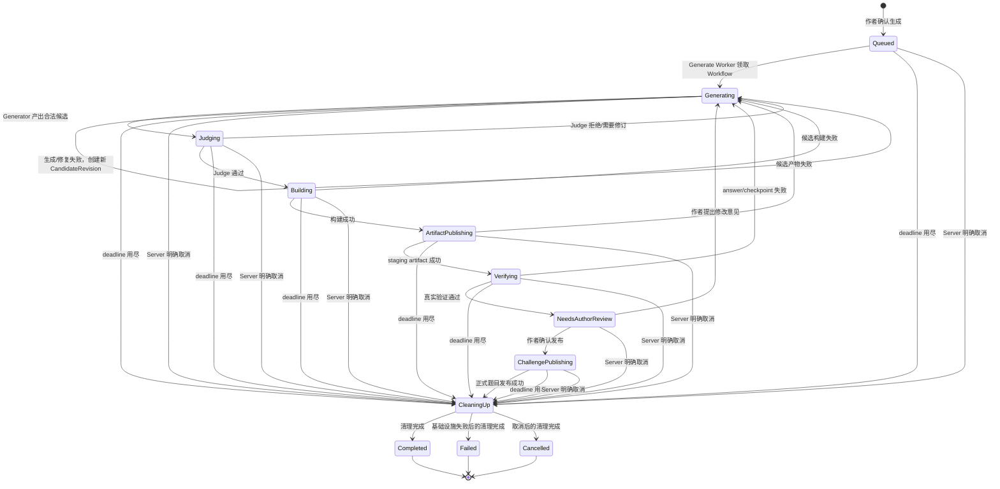
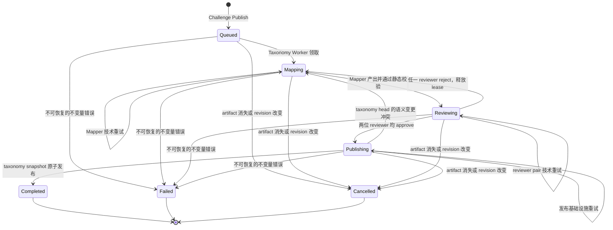

# 下一阶段：单一 Generation Workflow

当前的 Builder、Publisher、Verifier 与 Agent Worker 按 `kind` 创建和领取 `build`、
`artifact_publish`、`verify` 等任务。即使只合并进程，这仍然只是把旧任务队列塞进同一容器，
没有真正合并工作流。

本次重构的目标是：交互式 Agent 回到 Server；一道题目的生成与发布过程只有一个持久化
`GenerationWorkflow`，由 Generate Worker 按当前阶段继续执行并通过 Server 内部接口报告结果；taxonomy
保留为独立的 `TaxonomyWorkflow`。后台阶段不再是独立 WorkItem，也不再使用通用 `kind` 路由。

## 顶层架构

```text
Browser
  |
  v
Server <----------------------> PostgreSQL
  |                                  |
  | Environment CRD                 | GenerationWorkflow
  |                                  | TaxonomyWorkflow
  |                                  v
  |                           Generate Worker x N
  |                           Taxonomy Worker x M
  v
Controller
  |
  v
Environment resources

Server directly runs Authoring / Assistant conversations and streams replies to Browser.

Registry: Kind development NodePort Registry or production external OCI Registry
Environment: NodeEnvironment / VK8sEnvironment and their runtime resources
```

系统仍是六个顶层架构部分；Worker 是一个逻辑部分，初始由两个职责明确的 Deployment 组成：

| 部分 | 形态 | 职责 |
| --- | --- | --- |
| Server | Deployment | 用户 API、领域逻辑、题库、Workflow 状态唯一写者、内部 Worker API，以及直接执行 Authoring/Assistant 对话。 |
| Controller | Deployment | 只调和 NodeEnvironment/VK8sEnvironment CRD，供应和回收真实环境。 |
| PostgreSQL | StatefulSet 或外部托管服务 | 保存 Workflow、AgentRun、CandidateRevision、作者会话和学习事实。 |
| Registry | Kind overlay Deployment 或生产外部服务 | 保存候选及正式 OCI 运行时产物。 |
| Worker | 两个 Deployment | Generate Worker 一次执行一个完整 GenerationWorkflow；Taxonomy Worker 一次执行一个完整 TaxonomyWorkflow；均不直接访问 PostgreSQL。 |
| Environment | CRD 与动态资源 | 用户学习环境和真实验证环境，不是常驻 Deployment。 |

Server 与 Controller 不合并。Server 拥有领域数据和 Workflow，Controller 只拥有 Environment 的 reconcile/status。
Kind 开发 overlay 提供固定 NodePort Registry；生产环境由运营方提供外部 OCI Registry。Environment 由 Controller
在 Kubernetes/vcluster 或 Incus 中实现。

## Generation Workflow 边界

作者和 Agent 的题意讨论仍然属于 `AuthoringSession`。作者确认“生成题目”后，Server 创建一个
`GenerationWorkflow`，它贯穿候选生成、真实验证和最终发布：

```text
AuthoringSession (author confirms)
  -> GenerationWorkflow
       -> generate -> judge -> build -> artifact_publish -> verify
       -> needs_author_review -> challenge_publish -> cleanup -> completed
```

一次 Workflow 只有一个持久身份。阶段推进不会创建新的 WorkItem；同一 Workflow 中可以产生多个
`AgentRun` 和多个不可变 `CandidateRevision`。

### 状态转移图



图中的“失败”需要区分：

- `GenerationWorkflow.state` 是唯一的生命周期枚举：`Queued`、`Generating`、`Judging`、`Building`、
  `ArtifactPublishing`、`Verifying`、`NeedsAuthorReview`、`ChallengePublishing`、`CleaningUp`、`Completed`、
  `Failed`、`Cancelled`。不再同时维护 `current_phase` 和 `status`。
- 候选内容、脚本、answer 或 checkpoint 的失败，不直接暴露给作者，Workflow 回到 `Generating`，
  使用同一个 Generator session 产生新的 CandidateRevision。
- Server、Registry、Kubernetes、Incus、Provider 或 Generate Worker 故障，在 Workflow deadline 内重试当前阶段，
  不改变候选内容；deadline 用尽后以结构化 `failure_class=infrastructure` 进入 `CleaningUp`，清理完成才进入
  `Failed`。
- `NeedsAuthorReview` 不占用 Worker lease。作者反馈重新进入 `Generating`，作者确认才进入 `ChallengePublishing`。
- 一个 Workflow 只有一份总执行预算，在首次被 Generate Worker 领取时开始消耗；`Queued` 与 `NeedsAuthorReview`
  不消耗它。进入 `NeedsAuthorReview` 时，Server 暂停 deadline；恢复活动 state 时以剩余预算继续，而不是为每个 state
  重置一小时 deadline。
- `Cancelled` 不由 Judge、脚本失败、浏览器关闭、WebSocket 断开或 Worker 故障触发。它只能由作者明确丢弃整个
  AuthoringSession、一个明确的新 Workflow 替代当前 Workflow，或管理员中止触发。Server 取消 lease、围栏迟到结果，
  先进入 `CleaningUp`，清理完成才成为终态。
- `CleaningUp` 只保存一个不可变的 cleanup intent（`completed`、`failed` 或 `cancelled`），以便 Worker 崩溃后能按
  确定资源引用恢复清理；它不是第二套 Workflow 状态或可由客户端自由修改的字段。

## Taxonomy Workflow

Taxonomy 是一个维护领域；当前先实现最小的 `TaxonomyWorkflow`：它对应唯一的 `(challenge_id, challenge_revision)`，
在 Challenge Publish 后由 Server 创建或获取，为新发布题目补充 Skill、Tag 与 mapping。在其完成前，题目不进入公开 Catalog。
Server 的 catalog scanner 只负责补回“文件系统已发布但尚未创建 Workflow”的缺口，不直接修改 taxonomy 内容。

### 状态与轮次

`TaxonomyWorkflow.state` 是独立的单一状态枚举：`Queued`、`Mapping`、`Reviewing`、`Publishing`、`Completed`、
`Failed`、`Cancelled`。



一个 semantic round 由“Mapper candidate + reviewer pair”组成。`round` 只在两位 reviewer 结论均合法、且至少一位
`reject` 时递增；两份意见一起持久化，Server 刷新 `base_taxonomy_revision`、重置 `state_attempt`、将 Workflow 回到
`Mapping` 并写入立即可运行的 `next_run_at` 后释放 lease，下一次领取的 Mapper 必须读取它们。
模型输出无效、传输失败、超时或静态结构校验失败都是技术失败，不增加 `round`，也不把错误候选或单边 review 当作
委员会结论。

### 委员会执行与重试

一个 `taxonomy-worker` Pod 同时只持有一个 TaxonomyWorkflow lease。该 Workflow 内的角色和顺序固定：

```text
Mapper -> Curriculum Reviewer + SRE Reviewer (parallel) -> Server publish
                    ^ reject
                    |____________________________________ 释放 lease；下一次领取的 Mapper 读取两份意见
```

- Mapper 以 `base_taxonomy_revision`、目标题目的 immutable artifact 和上一 round 的正式意见生成完整 ChangeSet。
- ChangeSet 必须先经 Server 的严格 typed/static 校验。当前最小实现只能复用已有 Skill/Tag、创建新 Skill/Tag、
  创建目标 challenge mapping，并为本次新建 Skill 声明 `Skill.requires`；不能修改或删除已有 Skill、Tag、已有
  `Skill.requires` 或其他 challenge 的 mapping。
- 两位 reviewer 必须同时开始且都产生合法结果。任一调用或结果失败时，丢弃另一位的结果，完整重跑 reviewer pair。
- 当前 state 的连续技术失败计入 `state_attempt`。达到 10 次时，Worker 不会中断正在运行的调用；本次调用结束后释放 lease，
  保留 state、round 与候选，写入退避后的 `next_run_at`，由下一次 Taxonomy Worker 接管。它不是 `Failed`，也不是新 round。
- Worker 崩溃或 lease 过期时，下一副本从持久化 state 接管。若崩溃发生在 reviewer pair 中，未同时持久化的结果一律丢弃并重跑 pair。

每次模型调用都保存为关联该 Workflow、round 和角色（Mapper、Curriculum Reviewer、SRE Reviewer）的 `AgentRun`。`AgentRun`
只记录调用，不拥有 lease 或调度状态；所有结果报告必须携带 TaxonomyWorkflow 的 lease credential，迟到结果由 Server 拒绝。

### Snapshot 发布与并发

两位 reviewer approve 后进入 `Publishing`。Taxonomy Worker 只向 Server 提交已批准的 ChangeSet；Server 是 taxonomy 文件系统
的唯一写者，并在短暂的 publish 临界区内串行化 `taxonomy/current` 的更新。这不是另一个队列：多个 TaxonomyWorkflow 可以
并行 Mapping/Reviewing，只有不可变 snapshot 的最终构造、校验和指针替换需要串行。

Server 以 Workflow 保存的 `base_taxonomy_revision` 与当前 taxonomy head 比较：

- ChangeSet 仅修改目标 challenge mapping 时，Server 可以在最新 snapshot 上确定性重验并直接发布。
- ChangeSet 包含新建 Skill、Tag 或新的 `Skill.requires` 时，head 已变化意味着语义上下文过期；Server 清除 candidate/reviews，
  `round + 1` 后回到 `Mapping`，由 Mapper 基于最新 snapshot 重做委员会流程。

发布前 Server 先计算并持久化预期 snapshot revision，再原子写入 `revisions/<sha256>` 并替换 `current` 指针；若在文件系统与
数据库更新之间崩溃，恢复器只观察该预期 revision 是否已成为 current，匹配则完成 `Completed`，不匹配则报告不变量错误。
`Cancelled` 只用于目标题目 artifact 消失、revision 改变或管理员中止；`Failed` 只用于存储损坏等不可自动恢复的不变量错误。

当前的单题 Workflow 是 taxonomy maintenance 的最小实现，不伪装成完整的全局图维护能力。题库形成规模后，再增加明确的
全局 maintenance workflow：它读取完整 snapshot，才允许审查或修改既有 Skill、Tag 与 `Skill.requires`；仍由
`taxonomy-worker` 执行，不把这种全局变更混入新题 mapping。

## 持久化模型

将现有阶段型 `work_items` 重构为 `generation_workflows` 与 `taxonomy_workflows`（开发阶段允许直接删除旧表并重建，
不保留兼容迁移）。`GenerationWorkflow` 至少保存：

- `id`
- `authoring_session_id`
- `state`
- `cleanup_intent`（仅 `CleaningUp` 时存在）
- `candidate_revision_id`
- `active_agent_run_id`
- `state_attempt`
- `lease_owner`、`lease_expires_at`
- `next_run_at`、`deadline_at`、`deadline_paused_at`
- `last_error`
- `created_at`、`updated_at`

进入 `NeedsAuthorReview` 时，Server 持久化 `deadline_paused_at`；离开该 state 时将暂停时长加回 `deadline_at` 后清空它。
因此 deadline 的暂停、Server 重启和剩余执行预算都可恢复，不需要第二个状态枚举。

`TaxonomyWorkflow` 至少保存：

- `id`
- `challenge_id`、`challenge_revision`
- `state`
- `base_taxonomy_revision`
- `round`、`state_attempt`
- `candidate_changeset`、`curriculum_review`、`sre_review`
- `expected_snapshot_revision`、`published_revision`
- `lease_owner`、`lease_expires_at`、`next_run_at`
- `last_error`
- `created_at`、`updated_at`

所有阶段共用这一条 Workflow 记录，不再有 `kind`、`subject_type` 或“每个阶段一条任务”的关系。

其他记录的职责保持清晰：

- `AgentRun`：一次模型调用的 session、输入、typed result 和执行错误；它不是调度任务。
- `CandidateRevision`：一份不可变候选归档及其构建、artifact、验证和发布引用；它不是阶段状态机。
- `GenerationWorkflow`：唯一的流程阶段、lease、attempt、deadline 和恢复权威。
- `AuthoringSession`：作者与 Agent 的题意讨论和可见 revision。
- `TaxonomyWorkflow`：一个 challenge revision 的 Mapper、reviewer pair 与 taxonomy 发布流程；它是独立的后台聚合，
  不混入 GenerationWorkflow，拥有自己的 state、round、lease、candidate/reviews 与发布引用。

Authoring 和学习助手不是后台 Workflow。Server 在同一会话内持久化用户消息和 AgentRun，并直接调用模型、执行受限工具、
将流式输出转发给浏览器，最后持久化完整回复。它们不创建 Worker lease、WorkItem 或待领取的后台任务。

CandidateRevision 不再重复保存 `Building`、`PublishingArtifact`、`Verifying`、`PublishingChallenge` 等 Workflow 阶段。
它只保存当前 revision 的内容和阶段产出；当前流程阶段由 GenerationWorkflow 的 `state` 唯一决定。

## Server、Generate Worker 与 Taxonomy Worker

Server 直接承载两类交互式 Agent：Authoring 对话和做题助手。用户消息到达后，Server 先保存消息和 AgentRun，再在请求上下文中
调用模型；模型增量经同一 Server 流式发送给浏览器，完成后 Server 保存完整回复和工具结果。一个会话同一时刻只允许一轮回复，
从而保持对话顺序；不同会话可由 Server 并发处理。Server 重启或浏览器断开会中止该轮调用并保留已完成历史，用户可在同一会话继续
提问，不尝试伪造恢复一条已经中断的模型调用。当前 Server 按单副本部署；多副本时的流式连接与共享文件系统协调留到独立的扩展设计，
不提前引入。

`generate-worker` 和 `taxonomy-worker` 是两个明确的 Deployment，均不携带 PostgreSQL DSN，所有状态只经 Server 内部 API
读写。Generate Worker 只领取 `GenerationWorkflow`；Taxonomy Worker 只领取 `TaxonomyWorkflow`。不存在通用 Worker、
通用 claim 路由、`kind` 字段或由 Worker 指定下一阶段的协议。

```text
POST /api/internal/generation-workflows/claim
POST /api/internal/generation-workflows/:id/renew
POST /api/internal/generation-workflows/:id/phase
POST /api/internal/taxonomy-workflows/claim
POST /api/internal/taxonomy-workflows/:id/renew
POST /api/internal/taxonomy-workflows/:id/phase
```

`GenerationWorkflow` 的 `phase` 接口必须携带：

- Workflow ID
- lease credential（attempt + lease owner）
- expected current state
- 合法的阶段结果
- typed output reference 或结构化 failure

Server 在事务中校验合法状态迁移、保存阶段输出引用并更新 Workflow。Worker 不能自行跳过阶段、修改作者审核状态或
直接推进数据库中的下一阶段。阶段结果应按阶段使用明确的 Go 类型，不用一个任意 JSON 字段绕过校验。

Generate Worker 从 `Queued` 领取一个 Workflow 后，在全部活动 state 间持有并续租同一 lease；只有进入
`NeedsAuthorReview`、完成、取消、失败或达到 deadline 才释放。Generate Worker 崩溃或 lease 过期后，另一个副本重新领取同一
Workflow，从数据库保存的 `state` 继续。构建、Registry、
Environment 和发布操作必须使用由 Workflow ID、CandidateRevision ID 和 state attempt 派生的确定名称，并实现
create-or-observe，避免副作用已完成但报告未提交时重复创建资源。

## 调度与并发

交互式对话不进入后台调度。Server 是 HTTP/WebSocket 服务，多个 Authoring 或学习助手会话可直接并发；同一会话只串行一轮回复，
保证消息和工具上下文的顺序。当前不实现模型 API 配额、每用户限流或交互队列；后续确有真实配额需求时再单独设计，不能反向污染
Workflow 调度模型。

后台并发只由两个 Deployment 的副本数控制：

| Deployment | 一个 Pod 同时执行 | 并发上限 | 内部执行 |
| --- | --- | --- | --- |
| `generate-worker` | 一个 `GenerationWorkflow` | `generate-worker.replicas` | 按 state 顺序执行 Generator、Judge、Build、Artifact Publish、Verify、Challenge Publish 与 Cleanup；`NeedsAuthorReview` 不占 Pod。 |
| `taxonomy-worker` | 一个 `TaxonomyWorkflow` | `taxonomy-worker.replicas` | Mapper 后执行 reviewer pair；pair 可以在同一 Workflow 内并行调用，但不拆成独立调度任务；合法 reject 后释放 lease，下一次领取进入新 round。 |

因此 Generate Worker 的副本数就是同时生成、构建或真实验证的题目数。Build 是其主要本地资源峰值，Pod 的 CPU、内存和临时存储按此配置；
其他阶段不需要额外的内部并发模型。Taxonomy 的资源和失败不会影响 Generation Workflow，二者可独立扩缩容。未来新增后台能力时，
只有它拥有独立的持久流程、资源轮廓或失败语义，才新增一个明确 Worker Deployment；不能重新引入按 `kind` 路由的万能队列。

## 实施顺序

1. 增加 `GenerationWorkflow` 领域模型、唯一 `state` 枚举、`NeedsAuthorReview`/`CleaningUp` 转移表与清理恢复测试。
2. 将 `work_items` 改为两个明确的后台聚合：`GenerationWorkflow`、`TaxonomyWorkflow`；为 taxonomy 增加 Mapper/reviewer/
   publish 状态机、round、state attempt、lease 和 snapshot 发布恢复记录；删除 `kind`、`subject_type` 和按阶段创建任务的逻辑。
3. 将 Authoring 和学习助手的 AgentRun 迁入 Server 直接流式执行；对话消息、流式增量和最终回复均由 Server 持久化，不进入
   Worker 调度。Generator/Judge 与 taxonomy Mapper/reviewer 则归属各自的后台 Workflow。
4. 将生成、Judge、构建、artifact 发布、验证、正式发布和 cleanup 的 Server 回调改为阶段报告接口；每次报告与 Workflow
   state 在同一事务提交。
5. 将 Generator/Judge、Builder、Publisher、Verifier 装配到 `cmd/generate-worker`，每个 Pod 一次领取一个完整 GenerationWorkflow；
   将 taxonomy executor 装配到 `cmd/taxonomy-worker`，每个 Pod 一次领取一个完整 TaxonomyWorkflow。
6. 删除旧的 Agent Worker、Builder、Publisher、Verifier、通用 `ClaimNext`、`ClaimCandidateWork(kind)`、`/work-items/:kind`
   路由，以及对应的身份/RBAC/NetworkPolicy 和 Deployment。
7. 更新数据库、OpenAPI、前端作者状态、指标、Telepresence、部署清单和架构文档；Server 获得交互 Agent 所需模型与工具能力，
   两类后台 Worker 只取得各自工作所需凭据。
8. 增加真实流程验收：Server 直接流式对话、成功、Judge 修订、验证失败自动修复、基础设施重试、Worker 崩溃接管、作者审核后发布、
   cleanup、取消，以及 taxonomy approve/reject 循环、reviewer pair 重试、并发 snapshot 发布和 stale artifact 取消。

本次重构不改变 NodeEnvironment、VK8sEnvironment、运行时初始化、Kind NodePort / 生产外部 Registry 契约或
Environment CRD 的语义；
只重构题目生成与发布的持久工作流。实现完成前不提交代码。
